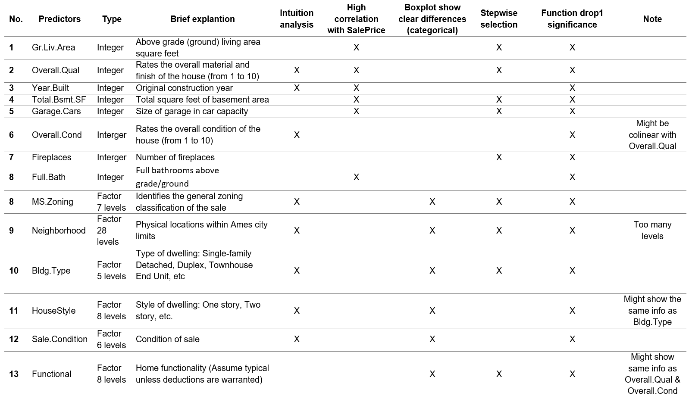
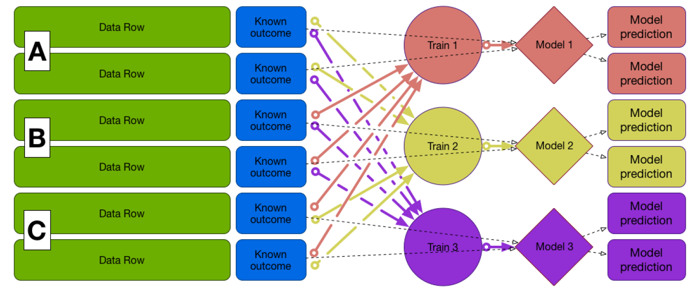

<style type="text/css">

body{ /* Normal  */
      font-size: 12px;
}
code.r{
  font-size: 11px;
}
pre {
  font-size: 11px
}
td {  /* Table  */
  font-size: 12px;
}
h1.title {
  font-size: 32px;
  font-weight: bold;
  text-align: center;
  color: #2A5A7A;
  opacity: 0.8;
}
h4.author { 
  font-size: 15px;
  color: #468faf;
  text-align: center;
}
h4.date { 
  font-size: 16px;
  font-family: "Times New Roman", Times, serif;
  color: DarkRed;
  text-align: center;
}
h1 { /* Header 1 */
  font-size: 22px;
  color: Black;
  font-weight: bold;
}
h2 { /* Header 2 */
    font-size: 18px;
  color: Black;
  font-weight: bold
}
h3 { /* Header 3 */
  font-size: 15px;
  color: Black;
  font-weight: bold
}

</style>

```{r setup, include=FALSE}
# Set the default mode for all the chunks
knitr::opts_chunk$set(message = FALSE, warning = FALSE, fig.align = "center", 
                      fig.height = 5, fig.width = 8)
```

```{r load-packages, include = FALSE}
# Load packages
library(dplyr)
library(ggplot2)
library(tidyverse)
library(scales)                      # formatting numbers on axis ggplot
library(gridExtra)
library(tidyr)
library(readr)
library(knitr)
library(lubridate)                   # to format date
library(egg)                         # plot layout 
library(PerformanceAnalytics)        # correlation matrix
library(GGally)                      # correlation matrix
library(corrplot)                    # correlation matrix
library(Hmisc)                       # correlation matrix
library(psych)                       # summary statistics
library(caret)                       # split data train-test
library(broom)                       # visualize fitted linear with categorical variable
library(MASS)
library(conflicted)                  # set conflict
library(ggthemes)
library(grid)
library(leaps)                       # stepwise selection
library(caret)                       # splitting train-test, SVM
library(forecast)                    # calculate RMSE
library(vtreat)                      # split plan for cross validation in lm
library(mgcv)                        # GAM
library(e1071)                       # SVM
library(caret)                       # SVM
library(kmed)                        # SVM
library(kernlab)                     # SVM
library(neuralnet)                   # For Neural Network required

# Set conflict preference
conflict_prefer("filter", "dplyr")
conflict_prefer("select", "dplyr")
conflict_prefer("compute", "neuralnet")

# Deactivate scientific notation
# options(scipen = 999)
```

```{r set-up-theme-for-ggplot, include = FALSE}
my_theme_general <- theme_minimal() +
  theme(
    plot.title = element_text(hjust = 0.5, face = "bold"),
        text = element_text(size = 10, color = "#495057"),
        panel.grid.major = element_line(linetype = "dashed"),
        panel.grid.minor = element_blank()
    ) 

my_theme_bar_chart <- theme_minimal() +
  theme(
    plot.title = element_text(hjust = 0.5, face = "bold"),
        plot.subtitle = element_text(hjust = 0.5),
        text = element_text(size = 10, color = "#495057"),
        panel.grid.minor = element_blank(),
        panel.grid.major.x = element_line(linetype = "dashed"),
        panel.grid.major.y = element_blank()
    )

my_theme_heat_map <-  theme_minimal() +
  theme(
    plot.title = element_text(hjust = 0.5, face = "bold"),
    text = element_text(size = 10, color = "#495057"),
    axis.text.x = element_text(angle = 90, vjust = 0.5, hjust=1)
    )

my_blank_theme <- theme_minimal()+
  theme(
  axis.title.x = element_blank(),
  axis.title.y = element_blank(),
  panel.border = element_blank(),
  panel.grid=element_blank(),
  axis.ticks = element_blank(),
  plot.title=element_text(size=14, face="bold")
  )
```

# Motivation and purpose

The study attempts to predict the house price in Ames, Iowa. To predict the house price, several machine learning methods will be used such as linear model (LM), Generalized Linear Model (GLM), Generalized Additive Model (GAM), Neural Network (NN), Support Vector Machine (SVM) and Optimization. Yet, before predicting price and applying models, it's vital to explore and understand the data. 

# Data comprehension

```{r load-data, include = FALSE}
# Load data
d_house <- read.csv("dataset/AmesHousing.csv", stringsAsFactors = TRUE) %>% 
  as_tibble()

# Check the variables
glimpse(d_house)

# Write a new Excel with all variable name and check if they are important to the house price
# names(d_house) %>% 
#   as_tibble() %>% 
#   writexl::write_xlsx("variables_intuition_analysis.xlsx")

# Exclude the irrelevant variables
d_house <- d_house %>% 
  select(-c(Order, PID))
```

There are 82 variables and 2930 observations in the data set. As there are many variables, we first have to examine and make a intuition analysis on every variable and its relevance to the main variable ´SalePrice´. Although this process can be very time-consuming, it shed the light to grasp the data better. How did we do that? Below are the step explanation:

* Reading and understanding every variable description
* Make a new Excel with two columns: variable name and importance to sale price (Yes/No). The decision of Yes/No is grounded on intuition, expectation and some house-price related articles. To be more specific, we question these following questions: which factor matters when we buy a house? How important would this factor be? Does this factor appear in other variables?

The intuition-based Excel file can be found in the `variables_intuition_analysis.xlsx`. At the first glimpse, we marked these might-be-relevant features to the SalePrice: MS.Zoning, Lot.Area, Street, Lot.Shape, Neighborhood, Bldg.Type, House.Style, Overall.Qual, Year.Built, Foundation, Total.Bsmt.SF, TotRms.AbvGrd, Mo.Sold, Yr.Sold, Garage.Cars, Sale.Condition.

After thinking of potential features, let's inspect the response variable in the next part. 

# The response variable - Sale price 

The scope of this analysis is to predict the housing sales price based on appropriate features. First, we plot the histogram and box plot of the sale price (i.e. the dependent variable).

```{r histogram-sales-price}
# Histogram
histogram_sale_price <- ggplot(d_house, mapping = aes(x = SalePrice)) +
  geom_histogram(aes(y=..density..), color="black", fill = "grey") +
  geom_density(alpha=.2, color ="blue") +
  scale_x_continuous(labels = comma) +
  labs(title = "Histogram of sale price") +
  my_theme_general

# Boxplot
boxplot_sale_price <- ggplot(d_house, mapping = aes(x = "", y = SalePrice)) +
  geom_boxplot(color = "black", fill = "grey") +
  scale_y_continuous(labels = comma) +
  coord_flip() +
   xlab("") +
  my_theme_general

# Display two plots together
egg::ggarrange(histogram_sale_price, boxplot_sale_price, heights = 2:1)

# Descriptive statistics summary of SalePrice
stats_SalePrice <- psych::describe(d_house$SalePrice)
```

The distribution of sale prices displays right-skewed with a long tail. The skew of `r stats_SalePrice$skew` confirms that the data are highly confirmed. Besides, the Kurtosis is `r stats_SalePrice$kurtosis`, i.e. Leptokurtic with a longer distribution and fatter tails. Some houses are very expensive. We have to carefully consider whether these expensive houses are outliers. Instead of dropping outliers, we apply the log transformation for sale prices. 

From the beginning to this point, we just follow the intuition for variable selection. However, this method can be too subjective. Hence, a more objective and systematic way need to be executed as the section below. Nevertheless, we still consider our initial thoughts as a double-check criteria and critical thinking in supplement with the multivariate study.    

# Numerical variable analysis

## Correlation matrix 

```{r corr-matrix}
# Overview correlation matrix of all numerical variables
d_house_numeric <- d_house %>% 
  select(where(is.numeric))

# Missing value check in numerical features -> not so many NA
round(colMeans(is.na(d_house_numeric)), 2) %>%  
  as.data.frame()

# Overview histograms of all numerical variables
# hist.data.frame(d_house_numeric)

# Create correlation matrix, use = complete to obmit NA, because not so many NA
m_cor <- cor(d_house_numeric, use = "complete") 

# Correlogram
corrplot(m_cor, method = "color", addCoef.col="black",
         order = "alphabet", number.cex=0.35, tl.cex = 0.55)
```

The correlation matrix shows some dark blue areas where variables are highly correlated to each other. To be more specific, `Garage.Area` is highly correlated `Garage.Cars` or other pairs such  `Gr.Liv.Area` with `TotRms.AbvGrd`; `Garage.Yr.Blt` with `Year.Built`. These pairs indicate the strong correlation and multi-collinearity. When we check these variables' meaning, they give almost similar information. Here, the correlation matrix is a crucial method to detect the multi-collinear problems in the feature selection process.

```{r corr-SalePrice}
# Calculate correlation matrix for all numerical features against SalePrice
m_cor_SalePrice <- round(
  cor(d_house_numeric, d_house["SalePrice"], use = "complete", ) ,2)

# Transform into tibble and sort correlation in a descending order
d_cor_SalePrice <- tibble(var_name = row.names(m_cor_SalePrice), 
       SalePrice = m_cor_SalePrice[, "SalePrice"]) %>% 
  arrange(desc(SalePrice))
d_cor_SalePrice 
```

Both variables have long tails to the right and many outliers. 

Remarkably, `Lot.Area`, the lot size in square feet is one of the variable we considered as important at the first sight but its correlation to the `SalePrice` is only 0.31. Let's look at the scatter plot of these two variables:

```{r scatter-SalePrice-Lot.Area}
# Scatter plot SalePrice & Lot.Area
scatter_price_lot <- ggplot(d_house, aes(x = Lot.Area, y = SalePrice)) + 
  geom_point() 

# Scatter plot SalePrice & Lot.Area but change the x & y range
scatter_price_lot2 <- ggplot(d_house, aes(x = Lot.Area, y = SalePrice)) + 
  geom_point() +
  xlim(0, 50000) +
  ylim(0, 500000)

# Plot the two side-by-side
egg::ggarrange(scatter_price_lot, scatter_price_lot2, ncol=2, nrow = 1)
```

The two plots show the same information but the right scatter displays the removal of outliers. The `Lot.Area` data points stay mostly at the smaller value and their price varies vertically for the same lot space.

## Top 10 variables correlated to SalePrice

The top 10 numerical features with the absolute highest correlation with the `SalePrice` are now selected and we produce a SalePrice correlation matrix as below:  

```{r top10-numerical-correlation}
# Make df of top 10 numerical variables with the absolute highest correlation to SalePrice
d_cor_top_10 <- d_cor_SalePrice %>%  
  mutate(abs_corr = abs(SalePrice)) %>% 
  arrange(desc(abs_corr)) %>% 
  slice(1:10)

# Make vector with variable name
v_top_10_cor <- d_cor_top_10 %>% 
  # Select the variable names and convert to vector 
  pull(var_name)

# Correlation matrix of top 10
m_cor_top_10 <- cor(d_house_numeric %>% 
               select(all_of(v_top_10_cor)), 
             use = "complete") 

# Correlogram
corrplot(m_cor_top_10, method = "color", addCoef.col="black", type = 'lower',
         order = "alphabet", number.cex=0.55, tl.cex = 0.55)

# Quick look on the scatter plot in pair for the top 10
ggpairs(d_house_numeric %>% select(all_of(v_top_10_cor)))
```

From the new correlation matrix, some important findings are found:

* `Garage.Area` and `Garage.Cars` are correlated highly with the dependent variable but they have the same information. Here, we keep the `Garage.Cars` as its higher correlation.  
* `SalePrice` is strongly correlated to `Gr.Liv.Area`, `Overall.Qual`, `Total.Bsmt.SF` 
* `Full.Bath` means full bathrooms above grade/ground. It seems to be strange here
* `BsmtFin.SF.1` and `Total.Bsmt.SF` display the related information, we choose `Total.Bsmt.SF` in this case
* `TotRms.AbvGrd` and `Gr.Liv.Area` are similar. Here, we choose `Gr.Liv.Area`
* `Year.Built`: 0.55 - moderately correlated to `SalePrice` 

After choosing the variables, let's make scatter plots to check the relationship between SalePrice and other variables

```{r scatter-plots-selected-var-vs-SalePrice}
# Selected numerical variables
d_select_num <- d_house_numeric %>% 
  select(SalePrice, Garage.Cars, Gr.Liv.Area, Overall.Qual, Total.Bsmt.SF, Full.Bath, Year.Built)

# list of selected variables 
l_vars <- c("Garage.Cars",  "Gr.Liv.Area", "Overall.Qual", "Total.Bsmt.SF", "Full.Bath",  "Year.Built")

# empty list for scatter plot
plotlist <- list()

# For loop to get several scatter plots at once with method = lm
for (idx in 1:length(l_vars)) {
  this_var <- l_vars[idx]
  p <- ggplot(d_select_num, aes_string(x = this_var, y = "SalePrice")) +
    geom_point() +
    geom_smooth(method = lm)
  plotlist[[idx]] <- p
} 

# 6 scatter plots at once
egg::ggarrange(plotlist[[1]], plotlist[[2]], 
               plotlist[[3]], plotlist[[4]],
               plotlist[[5]], plotlist[[6]], ncol=3, nrow = 2)
```

In general, some plots indicate that all of these variables have a linear positive relationship with the dependent variable `SalePrice`.

# Missing value

It's important to inspect the missing values in each variable. How is the ratio of missing value in each feature? What does the missing value mean in each case? Are missing values random? These questions are vital when we deal with the missing value. Removing them immediately without reflecting can cause data size reduction and bias.

```{r missing-values}
# Number of NA values in each column
d_number_missing_values <- colSums(is.na(d_house)) %>%  
  as.data.frame() 
colnames(d_number_missing_values) <- c("number")

# Percentage of NA values in each column
d_perc_missing_values <- round(colMeans(is.na(d_house)), 2) %>%  
  as.data.frame()
colnames(d_perc_missing_values) <- c("ratio")
d_perc_missing_values

# A summary table of missing values in each column
d_summary_missing_value <- cbind(d_number_missing_values, d_perc_missing_values)

# Change the summary missing values to tibble
d_summary_missing_value <- tibble(var_name = row.names(d_summary_missing_value), 
       n_missing = d_summary_missing_value[, "number"],
       perc_missing = d_summary_missing_value[, "ratio"]) %>% 
  arrange(desc(perc_missing)) 
d_summary_missing_value 

# Exclude the columns with 49% missing value
d_house <- d_house %>% 
  select(-c(Alley, Fireplace.Qu, Pool.QC, Fence, Misc.Feature))

# Remove the 1 NA rows from two important columns
d_house <- d_house %>% drop_na(Garage.Cars, Total.Bsmt.SF)
```

After examine the missing ratio, here are some decisions:

* Excluding all the columns with more than 49% of missing values, namely `Pool.QC`, `Misc.Feature`, `Alley`, `Fence` and `Fireplace.Qu`.Filling NA value is not applied because these variables are not so important and not the main factors to think about when we buy a house.
* Group of variables with "Garage": 5% are missing in these columns. Since we chose only `Garage.Cars` for the model in the previous part, we do not care about the rest.
* Group of variables with "Bsmt": similar principle as the group of "Garage"

# Categorical variables

In this section, we check the effects of different categorical features that are potentially relevant for the model. Before applying function drop1(), we visualize SalePrice with several categorical variables

## Visualizations of categorical variables

```{r Boxplot-Fuction}
# Make a function to draw all box plots
fill <- "#FFFFFF"
line <- "#000000"

boxplot_theme <- function(variable_input, title, variable) {
  output <- ggplot(d_house, aes(x = variable_input, y = SalePrice)) +
    geom_boxplot(fill = fill, colour = line) +
    ggtitle(title) +
    theme_minimal() +
    scale_y_continuous(labels = comma) +
    labs(x = paste0("\n", variable), y = "Price\n") + 
    theme(axis.text.x = element_text(angle = 45, vjust = 0.5, hjust=1),
          legend.position = "bottom", legend.direction = "horizontal",
          legend.box = "horizontal",
          legend.key.size = unit(1, "cm"),
          plot.title = element_text(family="Tahoma", hjust = 0.5),
          text = element_text(family = "Tahoma"),
          axis.title = element_text(size = 10),
          legend.text = element_text(size = 9),
          legend.title=element_text(face = "bold"))

  return(output)
}  
```

### MS.Zoning

`SalePrice` seems to vary among different `MSZoning`. Here, `MSZoning` identifies the general zoning classification of the sales such as agriculture, commercial, industrial. Especially Residential with low density (RL) and residential with medium density (RM) are strongly right skewed.

```{r ms.zoning}
# Boxplot price in ms zonings
title <- "General Zoning Classification"
variable <- "MS Zoning"
boxplot_theme(d_house$MS.Zoning, title, variable)
```

### Lot Shape

The general shapes of the property appear to be similar. With the exception that properties with a regular shape has a lower value compared to an irregular shape.

```{r LotShape}
# Boxplot price in different lot shapes
title <- "General shape of property"
variable <- "Lot Shape"
boxplot_theme(d_house$Lot.Shape, title, variable)
```

### Neighborhood

We identified especially in the neighborhoods strong variances regarding the prices. Especially Northridge (NoRidge) has a high price per property and shows some outliers in the direction of an higher price. 

```{r Neighborhood}
# Boxplot price in different neighborhoods
title <- "Physical locations within Ames city limits"
variable <- "Neighborhood"
boxplot_theme(d_house$Neighborhood, title, variable)
```

### Bldg.Type

The type of dwelling or house shows no radical differences for each category's median price. However, Single-family Detached (1Fam) has the highest potential and many tails to the higher prices.

```{r Bldg.Type}
# Boxplot price in different building types
title <- "Type of building"
variable <- "Building Type"
boxplot_theme(d_house$Bldg.Type, title, variable)
```

### House.Style

The same for House Style. The sales price for one story or two story is not strong impacted by the house style. 

```{r House.Style}
# Boxplot price in different house styles
title <- "Style of dwelling"
variable <- "HouseStyle"
boxplot_theme(d_house$House.Style, title, variable)
```

### Foundation

The `Foundation` variable consists of Brick & Tile, Cinder Block, Poured Contrete, Slab, Stone, Wood. The price seems to differ in different type of foundation but again, this can be a factor that was influenced by the `Year.Built`.

```{r Foundation}
# Boxplot price in different house styles
title <- "Foundation"
variable <- "Foundation"
boxplot_theme(d_house$Foundation, title, variable)
```

### Functional

The `Functional` variable consists of Brick & Tile, Cinder Block, Poured Contrete, Slab, Stone, Wood. The price seems to differ in different type of foundation but again, this can be a factor that was influenced by the `Year.Built`.

```{r Functional}
# Boxplot price in different house styles
title <- "Functional"
variable <- "Functional"
boxplot_theme(d_house$Functional, title, variable)
```

### Sale conditions

This variable indicate the condition of sale such as normal sale, abnormal sale (trade, short sale), sale between family members, adjoing land purchases etc. The median of the sales price is the highest among the Sales condition which was not completed when last assessed (associated with new homes). 

```{r Sale conditions}
title <- "Condition of sale"
variable <- "Sale Condition"
boxplot_theme(d_house$Sale.Condition, title, variable)
```

## Testing the effect of categorical variables

After several visualizations and descriptive analysis, let's fit the model with all highly potential categorical variables and then apply drop1() function to test their significance.

```{r drop1-categorical}
# Select all categorical might be relevant
d_house_selected_categorical <- d_house %>% 
  select(MS.Zoning, Neighborhood, Street, House.Style, Sale.Condition)

# Fit model with only these categorical variables
lm_cate_1 <- lm(log(SalePrice) ~ MS.Zoning + Neighborhood + Street + Foundation + 
                Bldg.Type + House.Style + Sale.Condition + Functional, 
                data = d_house)

# Check their significance effects
drop1(lm_cate_1, test = "F")
```

From the p-value obtained, `Street` does not seem to have a relevant effect on the response variable.

## Predictors of focus

As we have seen so far, the linear model describes relationship between the response variable $Y$ and the predictors $X_1,X_2,...X_n$. However, not all explanatory variables play an important role in predicting the random variable. Now, the question is if omitting a predictor would affect the degree to which the model fits the data, substantially deteriorated or not? As we will not fit the model with 74 predictors, it's vital to choose some focus variables, which are more potential and relevant for our model. 

### Stepwise selection

Command `regsubsets` from the library `leaps` runs the whole procedure automatically. Wherever TRUE is written, the corresponding explanatory variable is contained in model.

```{r step-wise-selection}
# Choose all variables exclude some variables starting with "Bsmt" because cannot run stepwise selection
d_exclude <- d_house %>% 
  select(!starts_with("Bsmt"))

# Fit all variables
lm_full <- lm(log(SalePrice) ~ ., data = d_exclude)

# Forward selection
reg_model <- regsubsets(log(SalePrice) ~ ., data = d_exclude, 
                        na.action=na.exclude, method = "forward", nvmax = 11)
reg_sum <- summary(reg_model)

reg_sum$which
```

Based on step wise selection, these are the features containing in the model: Gr.Liv.Area, Overall.Qual, Overall.Cond, Year.Built, Total.Bsmt.SF, Fireplaces, Garage.Cars. Some categorical variables with TRUE in one of the sub-categories are MS.Zoning, Neighborhood, Bldg.Type, Functional

### Testing the effects all potential features together

The function `drop1()` gives an overview about the comparison of original model to the model where one explanatory variable was omitted.  

```{r lm-fit-all-potential}
# Fitting all potential features together
lm_fit_focus <- lm(log(SalePrice) ~ Gr.Liv.Area + MS.Zoning + Neighborhood + 
                      Overall.Qual + Overall.Cond + Bldg.Type + Year.Built + 
                      Foundation + Total.Bsmt.SF + Fireplaces + Functional + 
                      House.Style + Garage.Cars + Sale.Condition, 
                    data = d_house)

# Testing all potential features together
drop1(lm_fit_focus, test = "F")

# Summary of the model 
summary(lm_fit_focus)
```

### Predictor summary

To sum up, we started with intuition analysis, numerical variable, then categorical variable analysis. Afterward, the step wise selection were conducted. Next, the `drop1` function to test the relevant effect of different variables on the response variables. Below is the finding summary of variables, which we focus from different methods:



# Train and test data

The data are divided into 70% train data and 30% test data because there are 2930 observations, which are large enough for that ratio. Moreover, we use function `createDataPartition()`, which helps to have more random split of the data.  

From the scatter plots in the numerical analysis part, there are some outliers, which do not follow the trend in the Gr.Liv.Area and Total.Bsmt.SF. Thus, we remove them first before fitting the model because keeping them will make the errors become extremely high and there are only 3 outliers. 

```{r train-test}
set.seed(12)
# We choose 70% for train data
indices <- createDataPartition(d_house$SalePrice, p = 0.70, list = F)

# Remove outliers from Gr.Liv.Area & Total.Bmst.SF & Garage.Cars
d_house <- d_house %>%
  filter(Gr.Liv.Area < 4500 & Total.Bsmt.SF < 4500)

# Train data
d_train <- d_house %>%
  slice(indices)

# Test data
d_test <- d_house %>%
  slice(-indices) 
```

# Linear model

## Fitting several models

To choose the best linear model, we fit several models on the train data and check the errors on the test data. At the end, we chose the best result for linear model. The fitting model process, we will use out sample cross validation, meaning that fitting model with train data and predict on the test data:

```{r lm-model-1}
# Model based on stepwise variables
lm1_train <- lm(log(SalePrice) ~ Gr.Liv.Area + Overall.Qual + Overall.Cond + 
                  Year.Built + Total.Bsmt.SF + Fireplaces + Garage.Cars + 
                  MS.Zoning + Bldg.Type + Functional, 
                data = d_train)
# Predict the model 1 on test data
pred_lm1_test <- predict(lm1_train, newdata = d_test)

# R^2
r_squared_lm1 <- cor(exp(pred_lm1_test), d_test$SalePrice)^2
# RMSE
## Way 1: manually
sqrt(mean((exp(pred_lm1_test) - d_test$SalePrice)^2))
## Way 2: by function
accuracy(exp(pred_lm1_test), d_test$SalePrice)

# more info about the model
broom::glance(lm1_train)
```

```{r lm-model-2}
# More simple model 
lm2_train <- lm(log(SalePrice) ~ Gr.Liv.Area + Year.Built + Overall.Qual + 
                  MS.Zoning, data = d_train)
# Predict the model 2 on test data
pred_lm2_test <- predict(lm2_train, newdata = d_test)
# R^2
r_squared_lm2 <- cor(exp(pred_lm2_test), d_test$SalePrice)^2
# RMSE
accuracy(exp(pred_lm2_test), d_test$SalePrice)
# more info about the model
broom::glance(lm2_train)
```

```{r lm-model-3}
# Model  
lm3_train <- lm(log(SalePrice) ~ Gr.Liv.Area + MS.Zoning +
                      Overall.Qual + Bldg.Type + Year.Built + Foundation + 
                      Total.Bsmt.SF + House.Style + Garage.Cars + Sale.Condition,
                na.action=na.omit,
                data = d_train)
# Predict the model 2 on test data
pred_lm3_test <- predict(lm3_train, newdata = d_test)
# R^2
r_squared_lm3 <- cor(exp(pred_lm3_test), d_test$SalePrice)^2
# RMSE
accuracy(exp(pred_lm3_test), d_test$SalePrice)
# more info about the model
broom::glance(lm3_train)
```

```{r lm-model-4}
# Model 
lm4_train <- lm(log(SalePrice) ~ Gr.Liv.Area +
                      Overall.Qual + Bldg.Type + Year.Built +
                      Garage.Cars + Sale.Condition,
                na.action=na.omit,
                data = d_train)
# Predict the model 2 on test data
pred_lm4_test <- predict(lm4_train, newdata = d_test)
# R^2
r_squared_lm4 <- cor(exp(pred_lm4_test), d_test$SalePrice)^2
# RMSE
accuracy(exp(pred_lm4_test), d_test$SalePrice)
# more info about the model
broom::glance(lm4_train)
```

```{r lm-model-5}
# Model with intuition variables
lm5_train <- lm(log(SalePrice) ~ Overall.Qual + Year.Built + Overall.Cond + 
                  MS.Zoning + Bldg.Type + Sale.Condition, 
                data = d_train)

# Predict the model 2 on test data
pred_lm5_test <- predict(lm5_train, newdata = d_test)
# R^2
r_squared_lm5 <- cor(exp(pred_lm5_test), d_test$SalePrice)^2
# RMSE
accuracy(exp(pred_lm5_test), d_test$SalePrice)
# more info about the model
broom::glance(lm5_train)
```

```{r lm-model-6}
# Model with high correlated variables
lm6_train <- lm(log(SalePrice) ~ Gr.Liv.Area + Overall.Qual + Year.Built + 
                  Full.Bath, 
                data = d_train)

# Predict the model 2 on test data
pred_lm6_test <- predict(lm6_train, newdata = d_test)
# R^2
r_squared_lm6 <- cor(exp(pred_lm6_test), d_test$SalePrice)^2
# RMSE
accuracy(exp(pred_lm6_test), d_test$SalePrice)
# more info about the model
broom::glance(lm5_train)
```

```{r lm-model-7}
# Model with variables appearing in several analysis
lm7_train <- lm(log(SalePrice) ~ Gr.Liv.Area + Overall.Qual + Year.Built + 
                  Total.Bsmt.SF + Garage.Cars + MS.Zoning + Bldg.Type + 
                  Functional, 
                data = d_train)
# Predict the model 2 on test data
pred_lm7_test <- predict(lm7_train, newdata = d_test)
# R^2
r_squared_lm7 <- cor(exp(pred_lm7_test), d_test$SalePrice)^2
# RMSE
accuracy(exp(pred_lm7_test), d_test$SalePrice)
# more info about the model
broom::glance(lm7_train)
```

```{r lm-model-8}
# Model altered
lm8_train <- lm(log(SalePrice) ~ Gr.Liv.Area + Overall.Qual + Year.Built  + 
                  Garage.Cars + MS.Zoning + Bldg.Type + Functional, 
                data = d_train)
# Predict the model 2 on test data
pred_lm8_test <- predict(lm8_train, newdata = d_test)
# R^2
r_squared_lm8 <- cor(exp(pred_lm8_test), d_test$SalePrice)^2
# RMSE
accuracy(exp(pred_lm8_test), d_test$SalePrice)
# more info about the model
broom::glance(lm8_train)
```

```{r lm-model-9}
# Model altered
lm9_train <- lm(log(SalePrice) ~ Lot.Area + Gr.Liv.Area + Overall.Qual + Year.Built +
                  Overall.Cond + Bldg.Type + Fireplaces + Functional +
                  Total.Bsmt.SF + Garage.Area, 
                data = d_train)
# Predict the model 2 on test data
pred_lm9_test <- predict(lm9_train, newdata = d_test)
# R^2
r_squared_lm9 <- cor(exp(pred_lm9_test), d_test$SalePrice)^2
# RMSE
accuracy(exp(pred_lm9_test), d_test$SalePrice)
# more info about the model
broom::glance(lm9_train)
```

## The final linear model

After fitting several models above, the final model is as below. In this part, we first fit the model  

```{r lm-final-model-all-data}
# Fit the final model with the whole dataset
lm_final <- lm(log(SalePrice) ~ Gr.Liv.Area + Overall.Qual + Overall.Cond + 
                  Year.Built + Total.Bsmt.SF + Fireplaces + Garage.Cars + 
                  MS.Zoning + Bldg.Type + Functional, 
                data = d_house)
# Predict the model 1 on test data
summary(lm_final)

# texreg::texreg(lm_final)
# texreg::htmlreg(lm_final)
```

### Estimated coefficients

Let’s look at the estimated regression coefficients.

```{r coeff}
# All coefficients
coef(lm_final)

## Interpreting the slope
exp(lm_final$coefficients["(Intercept)"])

## interpreting overall quality slope
(exp(lm_final$coefficients["Overall.Qual"])-1)*100

## building type "Duplex"
(lm_final$coefficients["Bldg.TypeDuplex"])
```

Interpretation 

* The intercept: When every predictors is zero, the house price is `r exp(lm_final$coefficients["(Intercept)"])` (extrapolation)
* The slope of `Overall.Qual`: For every one-scale increase in the overall quality (assuming all other predictors remain constant), the house price increases by about `r (exp(lm_final$coefficients["Overall.Qual"])-1)*100`%.
* Categorical variable `Bldg.Type`: Here, the  1Fam in the building type is used as the reference level. The `r lm_final$coefficients["Bldg.TypeDuplex"]` of Duplex is the difference of the intercept to 1Fam. 

If we are interested in estimating the magnitude of an effect and its uncertainty, let's look at the confident intervals for the `lm_final` model.

```{r lm-final-P-values–confidence-intervals}
confint(lm_final)
```

This final model were chosen based on the lowest RMSE and the highest adjusted R squared from the previous part. Notably, the adjusted R-squared to compare the goodness-of-fit for regression models that contain differing numbers of independent variables. That's why we use this to evaluate the models. 

### Prediction

It's important to examine visually the prediction errors of the model. We present predicted value in the original unit of the house price by applying the function `exp()`. 

```{r lm-final-prediction-plot}
# Make predictions from the model, exponential back the value
d_house_lm <- d_house %>% 
  mutate(pred_lm = exp(predict(lm_final)))

# Plot the predictions (on x axis) versus the house price
ggplot(d_house_lm, aes(x = pred_lm, y = SalePrice)) + 
  geom_point() + 
  geom_abline() +
  labs(title = "The actual Sale Price and the predicted Sale Price from linear model") +
  my_theme_general

# Calculate residuals
d_house_lm$residuals <- d_house_lm$SalePrice - d_house_lm$pred_lm

# Plot predictions (on x-axis) versus the residuals
ggplot(d_house_lm, aes(x = pred_lm, y = residuals)) + 
  geom_pointrange(aes(ymin = 0, ymax = residuals)) + 
  geom_hline(yintercept = 0, linetype = 3) + 
  ggtitle("Residuals vs. Linear Model prediction") +
  my_theme_general
```

Now, we will also plot the gain curve of the lm_final's predictions against actual SalePrice. For situations where order is more important than exact values, the gain curve helps us check if the model's predictions sort in the same order as the true outcome. When the predictions sort in exactly the same order, the relative Gini coefficient is 1. When the model sorts poorly, the relative Gini coefficient is close to zero, or even negative.

```{r lm-final-Gain-Curve}
# Plot the Gain Curve
WVPlots::GainCurvePlot(d_house_lm, "pred_lm", "SalePrice", "lm_final")
```

A relative gini coefficient of 0.96, $\approx$ 1, shows that the model correctly sorts high house price situations from lower ones.

### Assessing model accuracy

#### In-sample performance

We start with “in-sample” performance, which means the accuracy measured on models fitted to all data available.

```{r lm-final-insample-evaluation}
# R squared of the final model
glance_lm_final <- broom::glance(lm_final)
glance_lm_final
# RMSE of the final model
accuracy(exp(predict(lm_final)), d_house$SalePrice)
```

Observations:

* R-squared = `r glance_lm_final$r.squared`
* Adjusted R-squared = `r glance_lm_final$adj.r.squared`

The model explains 89% of the variance. Does this model is also better at making predictions on new observations that have not been used to train the model? Thus, we move to out-sample performance.

#### Out-sample performance

We now fit a part of the data to train the model and then test its predictive performance on a part of data that was splitted aside.

```{r lm-final-out-sample}
# Fit the model on the train data
lm_final_train <- lm(log(SalePrice) ~ Gr.Liv.Area + Overall.Qual + Overall.Cond + 
                  Year.Built + Total.Bsmt.SF + Fireplaces + Garage.Cars + 
                    Bldg.Type + Functional, 
                data = d_train)
# Predict the final model on test data
pred_lm_final_test <- predict(lm_final_train, newdata = d_test)

# R^2
r_squared_lm_final <- cor(exp(pred_lm_final_test), d_test$SalePrice)^2

# RMSE
accuracy_lm_final <- accuracy(exp(pred_lm_final_test), d_test$SalePrice)

# The standard deviation of the outcome
sd(d_house$SalePrice)
```

Observations:

* R-squared out-sample = `r r_squared_lm_final`: even higher than R squared in-sample
* RMSE = `r accuracy_lm_final[,"RMSE"]`: the standard deviation of the prediction errors is much smaller than the standard deviation of the house price (i.e., `r sd(d_house$SalePrice)` USD)
* MAPE = `r accuracy_lm_final[,"MAPE"]`: on average, the model predicts with approximately 10% errors. 

The cross-validation R-squared (measured on out-of-sample) is slightly higher than in-sample R-squared. The chosen linear model is therefore concluded as a good model because it does not overfit the data.   

#### Cross-validation

Previously, we fix the train and test data, does the result change if the data was split differently? To ensure about the model, we will make 3-way cross-validation as follows:



```{r lm-cross-validation}
# Create a cross-validation plan with 3 folds (partitions)
splitPlan <- kWayCrossValidation(nrow(d_train), 3, NULL, NULL)

# Remove some observations with very few cases in 2 variables MS.Zoning 
# and Functional 
d_house_lm <- d_house_lm %>%  
  filter(!MS.Zoning %in% c("A (agr)", "I (all)"), 
         !Functional %in% c("Sal", "Sev"))

# Run the 3-fold cross validation plan from splitPlan
k <- 3 # Number of folds
d_house_lm$pred.cv <- 0 
for(i in 1:k) {
  
  split <- splitPlan[[i]]
  model <- lm(log(SalePrice) ~ Gr.Liv.Area + Overall.Qual + Overall.Cond + 
                  Year.Built + Total.Bsmt.SF + Fireplaces + Garage.Cars +
                MS.Zoning + Bldg.Type + Functional, 
              data = d_house_lm[split$train,])
  d_house_lm$pred.cv[split$app] <- predict(model, 
                                           newdata = d_house_lm[split$app, ])
}

# Predict from a full model
d_house_lm$pred <- predict(lm(log(SalePrice) ~ Gr.Liv.Area + Overall.Qual + 
                                Overall.Cond + Year.Built + Total.Bsmt.SF + 
                                Fireplaces + Garage.Cars +
                MS.Zoning + Bldg.Type + Functional, data = d_house_lm))

# Get the rmse of the full model's predictions
ModelMetrics::rmse(d_house_lm$pred, d_house_lm$SalePrice)

# Get the rmse of the cross-validation predictions
ModelMetrics::rmse(d_house_lm$pred.cv, d_house_lm$SalePrice)
```

# Generalised Additive Model (GAM)

Not all predictors have a linear relationship with the response variable. In fact, there can be non-linear effects such as quadratic or polynomial or higher degree of complexity. Besides, whenever building models, we tend to face a trade-off between flexibility and interpretability. General Additive Models (GAMs) provides us a middle ground between simple models such as linear regression, and complex machine learning models like support vector machine (SVM).

However, we regularly have to model more advanced phenomena than can be represented by linear relationships. Machine learning models, e.g. neural networks or SVMs, can be very good at making predictions of complex relationships. The challenge with those Machine Learning models is that they tend to need lots of data which are quite difficult to interpret, and one can rarely make conclusions from the model results. 

As mentioned above, GAMs offer a middle ground: they can be fit to complex, nonlinear relationships and make predictions, but it is easier to understand the underlying structure of our models and its predictions. To create the models, we have chosen some more focused variables which were defined in the chapter variable selection. First, let's look at the relationship of predictors to the dependent variables with smooth trend lines:

```{r scatter-plots-version-2, echo = FALSE}
# Variable of focus for the model
d_select_2 <- d_house %>% 
  select(SalePrice, Garage.Cars, Gr.Liv.Area, Overall.Qual, Total.Bsmt.SF, 
         Year.Built, Fireplaces)

# list of selected variables 
l_vars_2 <- c("Garage.Cars",  "Gr.Liv.Area", "Overall.Qual", "Total.Bsmt.SF", 
              "Year.Built", "Fireplaces")

# empty list for scatter plot
plotlist2 <- list()

# For loop to get several scatter plots at once with not linear line
for (idx in 1:length(l_vars_2)) {
  this_var <- l_vars_2[idx]
  p <- ggplot(d_select_2, aes_string(x = this_var, y = "SalePrice")) +
    geom_point() +
    geom_smooth()
  plotlist2[[idx]] <- p
} 

# 6 scatter plots at once
egg::ggarrange(plotlist2[[1]], plotlist2[[2]], 
               plotlist2[[3]], plotlist2[[4]],
               plotlist2[[5]], plotlist2[[6]], ncol=3, nrow = 2)
```

Different from the linear assumption, some variables have non-linear effect with the price from the graph above. In this section, we fit 2 models on the train data and check the errors on the test data. Then, we will choose the best fitting model based on our results.

Let's start with the first model. For consistency, we have chosen the variables which resulted from the variable analysis in the first section. We also had to define the basis dimension k, which allows for great flexibility in curve fitting. 

## Model 1

### Fitting the model

```{r gam-model-1}
# Fitting model
gam1_train <- gam(log(SalePrice) ~ s(Gr.Liv.Area, k=10)+ s(Overall.Qual, k=10) + 
                    s(Overall.Cond, k=9)+ s(Year.Built, k=10) + 
                    s(Total.Bsmt.SF, k=10)+ s(Fireplaces, k=2)+ 
                    s(Garage.Cars, k=3) + MS.Zoning + Bldg.Type + Functional, 
                  data=d_train, method = "REML")
# Summary of the model
summary(gam1_train)
```

The deviance explained is 91.5% and the adjusted R-Square is 0.909. 

The summary output indicates a strong evidence that Gr.Liv.Area, Overall.Qual,  Overall.Cond, Year.Built, Total.Bsmt.SF, Fireplaces and Garage.Cars have effects on the response variable. Additionally, it indicates that the categorical variables Bldg.TypeDuplex, Bldg.TypeTwnhs, FunctionalMin1, FunctionalMin2, FunctionalMod, FunctionalSal , FunctionalSev and FunctionalTyp have an effect on the response variable.

The estimated degrees of freedom, edf in the output, quantify the complexity of the smooth function. If we look at the edf, it shows how complex the relationship between each predictor to the SalePrice. For the predictor Overall.Qual the edf is about 6.313. Let’s visualise the effect of this variable:

```{r gam-model-1-plot}
plot(gam1_train, residuals=TRUE, select = 2)
```

In this plot, the GAM fitted the model to the data points. This is different from linear regression, which only models linear relationships. On the other hand, the edf of Garage.Cars is almost one, meaning that this tern is considered to be a simple linear term. GAMs enables to fit a more flexible model. 

### Assessing model accuracy

We now predict on the test data and check the RMSE.

```{r gam-model-1-predict}
# Predict gam1 on the test data
pred_gam1_test <- predict(gam1_train, newdata = d_test)
# Accuracy of the model
gam1_accuracy <- accuracy(as.vector(exp(pred_gam1_test)), d_test$SalePrice)
gam1_accuracy
```

The RMSE is `r gam1_accuracy[,"RMSE"]`. 

Let's use the function gam.check() to produce some diagnostic information about the fitting procedure and results: 

```{r gam-model-1-gam.check}
gam.check(gam1_train)
```

In the first graph, there is the linear relationship between quantiles and residuals, which slightly deviates. Most of the residuals follow a normal distribution, however on the tails it more fat-tailed than normal distribution. In the second plot on top, we do not see any pattern from the residuals, they are scattered around 0. 

## Model 2

### Fitting the model

In our second model, we add some interactions within the variables with the function `te()`. `te()` terms are the smooth equivalent of main effects + interactions. Additionally, we can also specify a GAM formula that will fit different smooths for different categorical variables, as known as factor-smooth interaction. By specifying the "by" argument to the `s()` function, R will calculate a different smooth for each unique category. 

During the realization of this model, several interactions were tried between variables and the following model was the most successful:  

```{r gam-model-2}
# Fitting model gam 2
gam2_train <- gam(log(SalePrice) ~ te(Gr.Liv.Area, Overall.Qual, k=10) + 
                    s(Year.Built, k=20) +  s(Overall.Cond, k=9, by=MS.Zoning) + 
                    s(Total.Bsmt.SF, k=20, by=Bldg.Type) + s(Fireplaces, k=2) + 
                    s(Garage.Cars, k=4) + MS.Zoning + Bldg.Type + Functional, 
                  data=d_train, method = "REML")
# Summary of the model
summary(gam2_train)
```

The deviance explained is 92% and the adjusted R-Square is 0.917. This number is slightly higher than our first model. 

### Assessing model accuracy

We now predict our data on the test data: 

```{r gam-model-2-predict}
# Predict gam 2 on the test data
pred_gam2_test <- predict(gam2_train, newdata = d_test)
# Accuracy of the model
gam2_accuracy <- accuracy(as.vector(exp(pred_gam2_test)), d_test$SalePrice)
gam2_accuracy[, "RMSE"]
```

The RMSE is `r gam2_accuracy[, "RMSE"]`. This is slightly lower than our previous model which had a RMSE of `r gam1_accuracy[, "RMSE"]`. Let's now check our model with the gam.check() function:

```{r gam-model-2-gam.check}
gam.check(gam2_train)
```

In the first plot, there is the linear relationship between quantiles and residuals, which slightly deviates. Most of the residuals follow a normal distribution, however on the tails it more fat-tailed than normal distribution. 

Generally, we can assume that the model is good, however some outliers can't be explained with it. In the second plot, we don't see any pattern from the residuals, they are scattered around 0. In conclusion, the second model is slightly better, because the lower RMSE and explained deviance. 

# Generalised Linear Model (GLM) with family set to Poisson

## Model 1: Predicting number of cars

The house price, our main response variable is a continuous variable. In this part, we will predict another variable which is integer: `Garage.Cars`: The number of cars that a garage can have. 

We fit the model with these predictors: `Garage.Area`, `SalePrice` and `Land.Contour` (Flatness of the property with 4 levels: 1) Lvl: Near Flat/Level, 2) Bnk: Banked - Quick and significant rise from street grade to building, 3) HLS: Hillside - Significant slope from side to side, 4) Low: Depression)

However, this is just an example to fit a poisson model based on our dataset. We are fully aware that the garage cars are not really count in the sense of Poisson distribution assumption. More particularly, the variances of the observations does not linearly increases with the mean value. For instance, the box plot below shows no big difference between groups of Land.Contour. Similarly, we tried to make box plot of `Garage.Cars` with many different categorical variables to investigate. The dataset only consists the car number from 0 to 5. A house commonly does not have 20 cars. Other potential count variables such as `Fireplaces` and `Full.Bath` have the same issue. Hence, we just fit a Poisson model to illustrate:

```{r boxplot-cars-land-contour}
# Boxplot of Garage.Cars with Land.Contour
ggplot(data = d_house, mapping = aes(y = Garage.Cars, x = Land.Contour)) +
  geom_hline(yintercept = 0) + ## to highlight the lower bound of the data
  geom_boxplot() 
```

```{r glm1-poisson}
# Fit the poisson model to predict number of garage cars
glm1_poisson <- glm(Garage.Cars ~ Garage.Area + SalePrice + Land.Contour, 
                   family = "poisson", ## we specify the distribution!
                   data = d_house)

## summary Poisson model
summary(glm1_poisson)

## Coefficient: Land Coutour 
exp(coef(glm1_poisson)["Land.ContourHLS"]) %>% round(digits = 2)

## Coefficient: Garage.Area
exp(coef(glm1_poisson)["Garage.Area"])

## Coefficient: Sale Price
exp(coef(glm1_poisson)["SalePrice"]*10000)
```

Interpretation of Coefficient of Land Coutour:

R takes `Land.ContourBnk` (i.e., Banked - Quick and significant rise from street grade to building) as the reference. Hence, after applying exponential, the hillside (significant slope from side to side) land contour get, on average, 5% more garage cars than the banked land contour.

For a given home, increasing its number of Garage area by one square feet, would results in about 0.15% more cars. For a given home, increasing its price by 10000 USD, would results in about 3% more cars.

## Model 2: Predicting number of rooms above ground

The house price, our main response variable is a continuous variable. In this part, we will predict another variable which is integer: `TotRms.AbvGrd`: The number of rooms above ground. 

We fit the model with these predictors: `SalePrice` and `Bldg.Type`, `Year.Built` to determine `TotRms.AbvGrd`.  

This just an example to fit a poisson model based on our dataset. We are fully aware that rooms are house datasets not considereded as count data in the sense of Poisson distribution assumption. More particularly, the variances of the observations does not linearly increases with the mean value. For instance, ploting the room numbers with `Bldg.Type` shows an increase in variability, however this is not linearly increasing. With the quasipoisson we identify that we dispersion parameter below 1 and therefore we have underdispersed data

```{r boxplot-rooms-building-type}
# Boxplot of rooms with Building types
ggplot(data = d_house, mapping = aes(y = TotRms.AbvGrd, x = Bldg.Type)) +
  geom_hline(yintercept = 0) + ## to highlight the lower bound of the data
  geom_boxplot() 
```

```{r glm2-poisson}
# Fit the poisson model to predict number of rooms
glm2_poisson <- glm(TotRms.AbvGrd ~ Bldg.Type + Year.Built + SalePrice,
                   family = "poisson", ## we specify the distribution!
                   data = d_house)
## summary Poisson model
summary(glm2_poisson)

## Coefficient: Year Built
exp(coef(glm2_poisson)["Year.Built"])
## Coefficient: Sale Price
exp(coef(glm2_poisson)["SalePrice"]*10000)

## Identify RSME and compare to Standard Deviation
accuracy(exp(predict(glm2_poisson)), d_house$TotRms.AbvGrd)

sd(d_house$TotRms.AbvGrd)
```

Interpretation of Coefficients:

- For a given year (between 1872 - 2010), increasing the year by 1 year would result in about 0.11% less rooms.
- For a given home, increasing its price by 10000 USD, would results in about 1.7% more rooms.

The RMSE of the poisson model compared the the actual data is is 1.228. As this is smaller then the standard deviation of rooms in the house dataset.

```{r glm3-quasipoisson}
glm3_quasipoisson <- glm(TotRms.AbvGrd ~ Bldg.Type + Year.Built + SalePrice,
                   family = "quasipoisson", ## we specify the distribution!
                   data = d_house)

## summary Quasipoisson model
summary(glm3_quasipoisson)

## Coefficient: Year Built
exp(coef(glm3_quasipoisson)["Year.Built"])

## Coefficient: Sale Price
exp(coef(glm3_quasipoisson)["SalePrice"]*10000)

## Identify RSME and compare to Standard Deviation
accuracy(exp(predict(glm3_quasipoisson)), d_house$TotRms.AbvGrd)

sd(d_house$TotRms.AbvGrd)
```

The RMSE of the quasipoisson model compared the the actual data is is 1.228. As this is smaller then the standard deviation of rooms in the house dataset.

As the Poisson Models shows a dispersion parameter of 1. This information in the summary highlights that by fitting the Poisson Model, that the variance increases linearly with the mean. In a real setting, count data do not follow a Poisson distribution. If the dispersion parameter is higher than 1, we talk about overdispersed. This can be seen if the residual deviance is larger then the degrees of freedom. However, the opposite seems to be the case.

The quasipoisson model shows dispersion parameter is between 0.22. Therefore, the variance decrease slower then the mean value. We are therefore speaking about underdispersed data.

# Generalised Linear Model (GLM) with family set to Binomial

## Model 1: Predicting groups of price per square feet

In this part, we first calculate the house price per square feet by taking the `SalePrice` dividing by `LotArea`. To apply the binomial of GLM, two groups of price per square feet are created: upper and lower price. Afterward, we compute the ratio of upper price houses in the dataset based on their overall quality. Next, the GLM model is built on the rate of Price.Upper (number of successes) and Price.Lower (number of failures) to fulfill the binomial proportion.      

```{r glm1-create-two-price-groups}
# Create two groups of price according to the overall quality
d_house_glm1 <- d_house %>% 
  mutate(SalePrice.Per.SqrFeet = SalePrice / Lot.Area) %>% 
  group_by(Overall.Qual) %>%
  summarise(
    ## Upper price
    Price.Upper = sum(ifelse(SalePrice.Per.SqrFeet > mean(SalePrice.Per.SqrFeet), 1, 0)),
    ## Lower price
    Price.Lower = sum(ifelse(SalePrice.Per.SqrFeet <= mean(SalePrice.Per.SqrFeet), 1, 0)),
    ## Rate of upper
    Price.Upper.Rate = round(Price.Upper/(Price.Upper + Price.Lower), digits = 2))
```

```{r glm1-binomial-price-per-square-feet}
glm1_binomial <- glm(cbind(Price.Upper, Price.Lower) ~ Overall.Qual,
                    family = "binomial",
                    data = d_house_glm1)

summary(glm1_binomial)
```

After fitting the model, the overall quality seems not play a role in the price-per-square-feet groups. Indeed, its p-value is not significant. Also, the Overall.Qual slope is negative but we could not draw a conclusion since the variable is not significant in this case. However, we will still visualize the results of this model. The red dots are observed value and the predictions are a sequqnece of 100 observations that ranges from one to ten (black dots). 

```{r plot-Effect-Overall-quality}
# Plot Effect-Overall Quality
new_data <- data.frame(Overall.Qual = seq(1, 10, length.out = 100))
new_data$pred_price_upper_ratio <- predict(glm1_binomial, newdata = new_data,
                                 type = "response")

##
ggplot(data = d_house_glm1,
       mapping = aes(y = Price.Upper.Rate,
                     x = Overall.Qual)) + 
  ylim(0,1) +
  geom_hline(yintercept = 0:1, col = "gray") +
  ## predictions for conc 0 --> 10
  geom_point(data = new_data,
               mapping = aes(
      y = pred_price_upper_ratio,
      x = Overall.Qual)) +
  ## actual observations
  geom_point(col = "red", 
             size = 3)
```

As expected, the model does not predict so well. 

## Model 2: Predicting the central air

After the first model, we now attempt to predict whether a central air is in the house. Recall that the center air variable consist of Yes/No. Here, the `Overall.Qual` will be used as the predictor. Before fitting the model, let's check the plot of reposnse and independent variables. 

```{r glm2-central-air-plot}
# Create Center Air: 1 for yes and 0 for no
d_house_glm2 <- d_house %>% 
  mutate(Central.Air.new = ifelse(Central.Air == "Y", 1, 0))

# a logistic regression model and add the fit to the this graph
ggplot(data = d_house_glm2, mapping = aes(y = Central.Air.new, x = Overall.Qual)) +
  geom_point() +
  geom_smooth(method = "glm", 
              se = FALSE,
              method.args = list(family = "binomial")) 
```

There are two only possible outcomes here as yes/no or success/failure (coded as 1 and 0 respectively). The higher overall quality seems to have central air but there are also some low quality observations with central air. Let's fit the model as belows: 

```{r glm2-fitting}
# Fitting model 2 to predict Central.Air
glm2_binomial <- glm(Central.Air.new ~ Overall.Qual,
                data = d_house_glm2,
                family = "binomial")

# Summary of the model
summary(glm2_binomial)
```

The overall quality has a positive effect on the response variable. To interpret the coefficient of overall quality, we apply exponential function. When the overall quality increases by one level, the probability of having central air increases `r round(exp(coef(glm2_binomial)["Overall.Qual"]),1)` times. To evaluate the fitted values with the observed values (binary 0 or 1), it's important to discretize the fitted value into 0 and 1. At this stage, the cutoff of 0.5 is used.  

```{r}
# Discretise the fitted value into 0 and 1 with the cutoff of 0.5
fitted_glm2_binomial <- ifelse(fitted(glm2_binomial) > 0.5,
                               yes = 1, no = 0)

# Make a data frame of observed and fitted values
d_obs_fit_glm2 <- data.frame(obs = d_house_glm2$Central.Air.new,
                             fitted = fitted_glm2_binomial)

# summarise them into a table
table(obs = d_obs_fit_glm2$obs,
      fit = d_obs_fit_glm2$fitted)
```

To compare the observed and fitted values after discretizing, we summarize them in the confusion matrix above. 14 observations were correctly labeled to be No and 2726 observations were correctly labeled to be Yes. Nevertheless, 182 were wrongly classified by the model to be Yes but in reality, they are No (false positives). Besides, the model made mistakes of 3 observations as being No while they were not in reality (false negative). 

# Support Vector Machines (SVM)

SVM are supervised learning models and widely used for classification problems. Therefore, we predict the types of building in this chapter to apply this model. As we have 5 different categories, we combined 2fmCon (Two-family Conversion; originally built as one-family dwelling) and 1Fam (Single-family Detached). The reason is that 2fmCon was build as an one-family dwelling. Additionally, we combine TwnhsE (Townhouse End Unit) with Twnhs (Townhouse Inside Unit) because they are both "town house". 

## Predictors

```{r groupping-Buildingtype}
# Copying d_house as SVM Dataframe
d_svm <- d_house

# Creating Character for Renaming
d_svm$Bldg.Type <- as.character(d_svm$Bldg.Type)

# Regrouping and Renaming building type
d_svm$Bldg.Type[d_svm$Bldg.Type == "1Fam"] <- "Familycom"
d_svm$Bldg.Type[d_svm$Bldg.Type == "2fmCon"] <- "Familycom"
d_svm$Bldg.Type[d_svm$Bldg.Type == "Duplex"] <- "Duplex"
d_svm$Bldg.Type[d_svm$Bldg.Type == "Twnhs"] <- "Townhouse"
d_svm$Bldg.Type[d_svm$Bldg.Type == "TwnhsE"] <- "Townhouse"

# Returning Factor for building type
d_svm$Bldg.Type <- as.factor(d_svm$Bldg.Type)

# Inspecting distribution of building types
table(d_svm$Bldg.Type)
```

To check which variables might be relevant to predict the building type, it's necessary to make several boxplots to investigate some predictors:

```{r SVM-Boxplot-Building-Type}
fill <- "#FFFFFF"
line <- "#000000"

boxplot_theme_bldgtype <- function(variable, variable_input) {
  output <- ggplot(d_svm, aes(x = Bldg.Type, y = variable)) +
    geom_boxplot(fill = fill, colour = line) +
    ggtitle(variable_input) +
    theme_minimal() +
    scale_y_continuous(labels = comma) +
    labs(x = paste0("\n", "Building Type"), y = paste0("\n", variable_input)) + 
    theme(axis.text.x = element_text(angle = 45, vjust = 0.5, hjust=1),
          legend.position = "bottom", legend.direction = "horizontal",
          legend.box = "horizontal",
          legend.key.size = unit(1, "cm"),
          plot.title = element_text(family="Tahoma", hjust = 0.5),
          text = element_text(family = "Tahoma"),
          axis.title = element_text(size = 10),
          legend.text = element_text(size = 9),
          legend.title=element_text(face = "bold"))

  return(output)
} 

# Several boxplot to check the effect of different variables on building type
boxplot_theme_bldgtype(log(d_svm$Lot.Area), "Lot.Area")
boxplot_theme_bldgtype(d_svm$Overall.Qual, "Overall.Qual")
boxplot_theme_bldgtype(d_svm$Year.Built, "Year.Built")
boxplot_theme_bldgtype(d_svm$TotRms.AbvGrd, "TotRms.AbvGrd")
boxplot_theme_bldgtype(d_svm$Garage.Area, "Garage.Area")
```

We checked several predictors, which might be the most suitable for predicting the Building Type. Due to box plots, we identified Lot.Area, Overall.Qual, Year.Built, TotRms.AbvGrd, Garage.Area, Bldg.Type to be the most suitable. To reduce omitting rows due to NA Values, we created a data frame with only the predefined predictors. We use the same train and testing tables as in the previous exercises.

```{r SVM-train-test-for-building-type}
# Logmarizing Lot Area due to be able to plot Lot Area
d_svm$Lot.Area <- log(d_svm$Lot.Area)

# Train data
d_train_svm <- d_svm %>%
  slice(indices) %>%
  select(Lot.Area, Overall.Qual, Year.Built, TotRms.AbvGrd, Garage.Area, Bldg.Type) %>%
  na.omit()

# Test data dropping the building type
d_test_svm <- d_svm %>%
  slice(-indices) %>% 
  select(Lot.Area, Overall.Qual, Year.Built, TotRms.AbvGrd, Garage.Area) %>% 
  na.omit()

# Test data truth
d_test_svm_truth <- d_svm %>%
  slice(-indices) %>%
  select(Lot.Area, Overall.Qual, Year.Built, TotRms.AbvGrd, Garage.Area, Bldg.Type) %>% 
  na.omit() %>% 
  pull(Bldg.Type)

table(d_svm$Bldg.Type)
```

Familycomplex is clearly the biggest category. This fact can also been seen, if we plot the various predictors in a ggplot. Below we plot Lot.Area in the x-axis to each of the other 4 predictors.

```{r SVM-Plot-variables, fig.height = 10, fig.width = 16}
plot_1 <- ggplot(data = d_svm, aes(x = Lot.Area, y = Overall.Qual, color = Bldg.Type)) +
  theme_minimal() +  geom_point(alpha = 0.3)

plot_2 <- ggplot(data = d_svm, aes(x = Lot.Area, y = Year.Built, color = Bldg.Type)) +
  theme_minimal() + geom_point(alpha = 0.3)

plot_3 <- ggplot(data = d_svm, aes(x = Lot.Area, y = TotRms.AbvGrd, color = Bldg.Type)) +
  theme_minimal() + geom_point(alpha = 0.3)

plot_4 <- ggplot(data = d_svm, aes(x = Lot.Area, y = Garage.Area, color = Bldg.Type)) +
  theme_minimal() + geom_point(alpha = 0.3)

egg::ggarrange(plot_1, plot_2, plot_3, plot_4, ncol=2, nrow = 2)
```

## Tune for cost

With the selected predictors, we can perform a support vector machine with the kernel: Linear, Radial, Polynomial and Sigmoid. However, after fitting many models, Linear could not predict the Duplex Type, our analysis shows mainly on Radial as the best result has been seen with this kernel. 

So as a first step, we identified the best cost for the the kernel Radial, which is 10. 

```{r SVM-Tune-cost-using-caret, message=FALSE, warning=FALSE}
tune.out <- tune(
  svm, Bldg.Type ~ Lot.Area + Overall.Qual + Year.Built + TotRms.AbvGrd + Garage.Area,
  data = d_train_svm,
  kernel = "radial",
  ranges = list(cost = c(0.1, 1, 10, 100, 1000)))

# Show Best Model
tune.out$best.model
```

Therefore, we trained a model with the all the determinded predictors and with the optimal cost for radial. 

```{r SVM-Train-Model}
svm_radial_train <- svm(Bldg.Type ~ ., d_train_svm, kernel = "radial", 
                        scale = TRUE, cost = 10)
```

To inspect, how our model performs on a plot, we noted that due to the high amount of Familicomplex, we were not able to see a clear split on a two dimensional plot. 

```{r SVM-Plot-pair-predictors}
plot(svm_radial_train, d_train_svm, Year.Built ~ Overall.Qual)
plot(svm_radial_train, d_train_svm, Lot.Area ~ Year.Built)
plot(svm_radial_train, d_train_svm, Lot.Area ~ TotRms.AbvGrd)
plot(svm_radial_train, d_train_svm, Lot.Area ~ Garage.Area)
plot(svm_radial_train, d_train_svm, Lot.Area ~ Overall.Qual)
plot(svm_radial_train, d_train_svm, Year.Built ~ TotRms.AbvGrd)
plot(svm_radial_train, d_train_svm, Year.Built ~ Garage.Area)
plot(svm_radial_train, d_train_svm, Overall.Qual ~ TotRms.AbvGrd)
plot(svm_radial_train, d_train_svm, Overall.Qual ~ Garage.Area)
plot(svm_radial_train, d_train_svm, TotRms.AbvGrd ~ Garage.Area)
```

## Assessing model accuracy 

```{r SVM-Prediction-Table}
pred_svm_radial <- predict(svm_radial_train, d_test_svm)
table(pred_svm_radial)
```


```{r SVM-Confusion-Matrix}
conf_matrix_radial <- confusionMatrix(pred_svm_radial, d_test_svm_truth)
```

```{r Support-Vector-Machine-Accuracy}
conf_matrix_radial$overall
```

Afterwards we inspect the accuracy of the model, which is `r round(conf_matrix_radial$overall[1],2)`. Which seems very high. Nevertheless, due to the large number of Familycomplex in this dataset, it can be a biased information. Let's have a look at the confusion matrix:

```{r Support-Vector-Machine-conf-matrix-radial}
conf_matrix_radial
```

Although, accuracy is 0.95, Duplex only could be correctly predicted 57% as seen in sensitivity.

## Cross-validation 

To validate our model, we performed three different cross validation model with the method svmLinear, svmRadial.

```{r SVM-Cross-Validation, message=FALSE, warning=FALSE, paged.print=FALSE}
# Model
trctrl <- trainControl(method = "repeatedcv", number = 5, repeats = 5)
svm_linear <- train(Bldg.Type ~ ., data = d_train_svm, method = "svmLinear", 
                    trControl=trctrl, preProcess = c("center", "scale"), 
                    tuneLength = 5)

trctrl <- trainControl(method = "repeatedcv", number = 5, repeats = 5)
svm_radial <- train(Bldg.Type ~ ., data = d_train_svm, method = "svmRadial", 
                    trControl=trctrl, preProcess = c("center", "scale"), 
                    tuneLength = 5)
```

```{r SVM-Cross-Validation-Linear, message=FALSE, warning=FALSE, paged.print=FALSE}
# Apply to the test data
test_pred_linear <- predict(svm_linear, newdata = d_test_svm)
confusionMatrix(test_pred_linear, d_test_svm_truth)
```

As seen before and already discussed, with the linear model, the differentiation between Duplex and Familycomplex is not recognized.

```{r SVM-Cross-Validation-Radial, message=FALSE, warning=FALSE}
# Apply to the test data
test_pred_radial <- predict(svm_radial, newdata = d_test_svm)
confusionMatrix(test_pred_radial, d_test_svm_truth)
```

With the cross validation model, we were able to fit a model with an accuracy of 0.95. Which, is only minimal better then our trained model. However, the sensitivity for the building type Duplex is in this case worse.

# Neural Network

## Scaling train and test data 

The main purpose of this chapter is to predict `SalePrice` with neural network. For using the neural Network to calculate a continuous output, we created used the same 70% as train data and 30% test data and removed all columns and removed all NA values to ensure proper application of neuralnet.

```{r train-test-for-NN-as-numeric}
# Create dataframe with numerical variables
d_house_numeric_nn <- d_house %>% 
  select(where(is.numeric)) %>%
  ## Remove the variables with many NA
  select(-c(Lot.Frontage, Garage.Yr.Blt)) %>% 
  na.omit()

# Train data
d_train_numeric <- d_house_numeric_nn %>%
  slice(indices) %>% 
  na.omit()

# Test data
d_test_numeric <- d_house_numeric_nn %>%
  slice(-indices) %>% 
  na.omit()

d_test_numeric_truth <- d_test_numeric %>%
  pull(SalePrice)
```

Additionally, the numerical values will be scaled to increase efficiency of the neural network and better application.

```{r Neural-Network-Scale-the-Dataset}
# Scale Testing & Train data
d_max <- apply(d_house_numeric_nn, 2, max)
d_min <- apply(d_house_numeric_nn, 2, min)
d_house_numeric_scaled <- as.data.frame(scale(d_house_numeric_nn, center = d_min, 
                                              scale = d_max - d_min))
d_train_numeric_scaled <- as.data.frame(scale(d_train_numeric, center = d_min, 
                                              scale = d_max - d_min))
d_test_numeric_scaled <- as.data.frame(scale(d_test_numeric, center = d_min, 
                                             scale = d_max - d_min))
```

Here we compare the training, testing and the full dataset to ensure that the distribution is properly distributed.

```{r Boxplot for Training & Test Data}
# train test with scaled
boxplot(d_train$SalePrice, d_test$SalePrice, d_house %>% sample_frac(1) %>% pull(SalePrice),
        main = "Prepare for Training",
        names = c("Training", "Testing", "Full Data"))
```

We performed the same step also for the scaled data. Here we see that all the Saleprices are between 0 and 1.

```{r Boxplot for Scaled Training & Test Data}
# train test with scaled
boxplot(d_train_numeric_scaled$SalePrice, d_test_numeric_scaled$SalePrice, d_house_numeric_scaled %>% sample_frac(1) %>% pull(SalePrice),
        main = "Prepare for Training Scaled",
        names = c("Training", "Testing", "Full Data"))
```

## Fitting several models - Neural Network

We fitting several neural network models with the train data. We fit 5 different models with the different of 3 and 5 hidden layers. However, because each neural network model takes a long time to run, we only present three models with the least errors here. For the first model, all numerical variables will be the predictors. Afterwards, the high correlated variables to SalePrice are used as predictors in this chapter. 

```{r NN-fitting-several-models}
# Fit NN 1 with all variables
nn1_train <- neuralnet(SalePrice ~ .,data = d_train_numeric_scaled, hidden = 3, 
                       linear.output = TRUE)
plot(nn1_train)

# Fit NN2 with selected variables
nn2_train <- neuralnet(SalePrice ~ Overall.Qual + Gr.Liv.Area + Garage.Cars + 
                         Total.Bsmt.SF + Year.Built + Full.Bath, 
                       data = d_train_numeric_scaled, hidden = 3, 
                       linear.output = TRUE)
plot(nn2_train)

# Fit NN3 with selected variables
nn3_train <- neuralnet(SalePrice ~ Overall.Qual + Gr.Liv.Area + Garage.Cars + 
                         Total.Bsmt.SF + Garage.Area + X1st.Flr.SF + 
                         Year.Built + Full.Bath + Year.Remod.Add, 
                       data = d_train_numeric_scaled, hidden = 5, 
                       linear.output = TRUE)
plot(nn3_train)
```

## Assessing model accuracy

```{r NN-prediction}
# Prediction NN 1
pred_nn1_test <- compute(nn1_train, d_test_numeric_scaled %>% select(-SalePrice))
pred_nn1 <- pred_nn1_test$net.result * 
  (max(d_house_numeric_nn$SalePrice) - min(d_house_numeric_nn$SalePrice)) + 
  min(d_house_numeric_nn$SalePrice)

# Prediction NN 2
pred_nn2_test <- compute(nn2_train, d_test_numeric_scaled %>% select(-SalePrice))
pred_nn2 <- pred_nn2_test$net.result * 
  (max(d_house_numeric_nn$SalePrice) - min(d_house_numeric_nn$SalePrice)) + 
  min(d_house_numeric_nn$SalePrice)

# Prediction NN 3
pred_nn3_test <- compute(nn3_train, d_test_numeric_scaled %>% select(-SalePrice))
pred_nn3 <- pred_nn3_test$net.result * 
  (max(d_house_numeric_nn$SalePrice) - min(d_house_numeric_nn$SalePrice)) + 
  min(d_house_numeric_nn$SalePrice)
```

To be able to visualize the models, we created a function to see the precision between predicted and actual. Additionally we add the RMSE and R^2 for further illustration.

```{r Neural-Network-Plots-pred-actual}
# Function for plot
compare_nn_theme <- function(model, title_number) {
  output <- ggplot(d_test_numeric, aes(x = model, y = SalePrice)) +
    geom_point() +
    geom_abline(intercept = 0, slope = 1) +
    labs(x = "Predicted Salseprice", y = "Actual Saleprice", 
         title = paste0("Neural Network Model ", title_number)) + 
    theme_minimal() +
    scale_y_continuous(labels = comma) +
    scale_x_continuous(labels = comma) +
    annotate("text",
             label = paste0("RMSE = ", round(RMSE(model, d_test_numeric_truth), 0), 
                            "\n", "R2 = ", round(R2(model, d_test_numeric_truth), 3)),
             x = 100000,
             y = 600000,
             col = "black",
             size = 5,
             hjust = "left")
  
return(output)}

# 3 plots together
egg::ggarrange(compare_nn_theme(pred_nn1, 1),
               compare_nn_theme(pred_nn2, 2),
               compare_nn_theme(pred_nn3, 3),
               ncol = 1,
               nrow = 3)
```

Based on the plot above, model 1 has the lowest RMSE and highest R squared. Therefore, model 1 is our final model for this section to predict SalePrice. 

## Cross-validation - Neural Network

To validate our model, we performed k-fold Cross Validation to ensure that we were not just lucky with our train and test data. Additionally, we used hyperparameter tuning to improve the model.

```{r Neural-Network-Cross-Validation}
# set.seed(12)
# start.time <- Sys.time()
# tuGrid <- expand.grid(.layer1=c(1:4), .layer2=c(0,2), .layer3=c(0))
# 
# 
# trCtrl <- trainControl(
#   method = 'repeatedcv', 
#   number = 5, 
#   repeats = 1, 
#   returnResamp = 'final')
# 
# models <- train(
#   x = d_house_numeric_nn %>% select(-SalePrice),
#   y = d_house_numeric_nn %>% pull(SalePrice),
#   method = 'neuralnet', metric = 'RMSE', 
#   linear.output = TRUE,
#   preProcess = c('center', 'scale'),
#   tuneGrid = tuGrid,
#   trControl = trCtrl)
# 
# end.time <- Sys.time()
# time.taken <- end.time - start.time
# time.taken
```

```{r Neural-Network-Plot-Cross-Validation}
# plot(models)
```

and extract the best model

```{r Neural-Network-Plot-Neural-Network}
# plot(models$finalModel)
```

