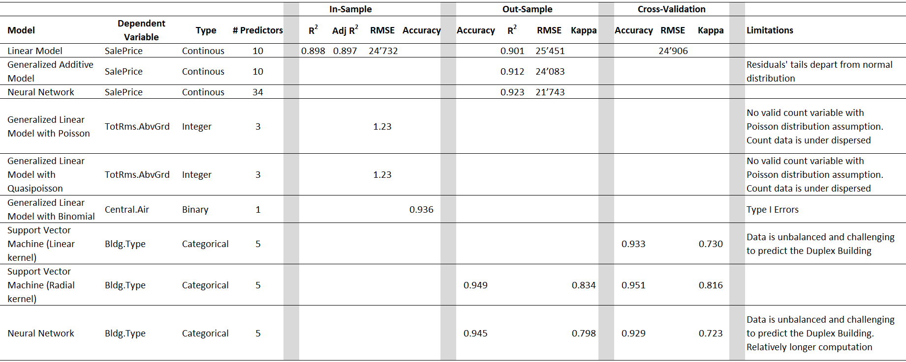
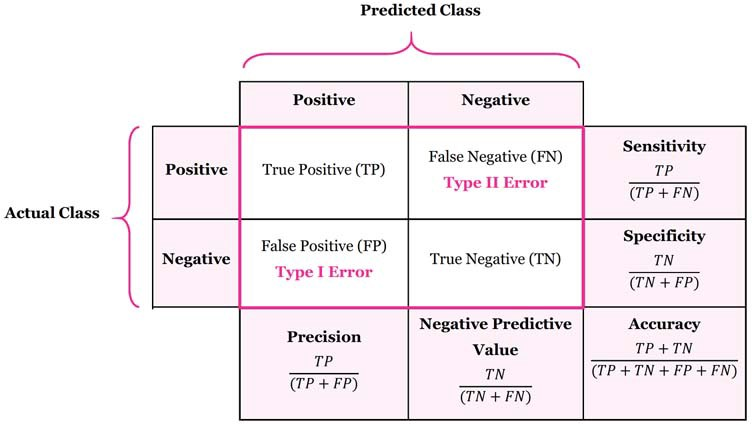

<style type="text/css">

body{ /* Normal  */
      font-size: 12px;
}
code.r{
  font-size: 11px;
}
pre {
  font-size: 11px
}
td {  /* Table  */
  font-size: 12px;
}
.math {
  font-size: 11px;
}
h1.title {
  font-size: 32px;
  font-weight: bold;
  text-align: center;
  color: #2A5A7A;
  opacity: 0.8;
}
h4.author { 
  font-size: 15px;
  color: #468faf;
  text-align: center;
}
h4.date { 
  font-size: 16px;
  font-family: "Times New Roman", Times, serif;
  color: DarkRed;
  text-align: center;
}
h1 { /* Header 1 */
  font-size: 22px;
  color: Black;
  font-weight: bold;
}
h2 { /* Header 2 */
    font-size: 18px;
  color: Black;
  font-weight: bold
}
h3 { /* Header 3 */
  font-size: 16px;
  color: Black;
  font-weight: bold
}
h4 { /* Header 4 */
  font-size: 14px;
  color: Black;
  font-weight: bold
}
</style>

```{r setup, include=FALSE}
# Set the default mode for all the chunks
knitr::opts_chunk$set(message = FALSE, warning = FALSE, fig.align = "center", 
                      fig.height = 5, fig.width = 8)
```

```{r setup-number, include=FALSE}
# To set numeric as integer to be well formatted when knit the report
inline_hook <- function(x) {
  if (is.numeric(x)) {
    format(x, digits = 2)
  } else x
}
knitr::knit_hooks$set(inline = inline_hook)
```

```{r load-packages, include = FALSE}
# Load packages
library(dplyr)
library(ggplot2)
library(tidyverse)
library(scales)                      # formatting numbers on axis ggplot
library(gridExtra)
library(tidyr)
library(readr)
library(knitr)
library(lubridate)                   # to format date
library(egg)                         # plot layout 
library(PerformanceAnalytics)        # correlation matrix
library(GGally)                      # correlation matrix
library(corrplot)                    # correlation matrix
library(Hmisc)                       # correlation matrix
library(psych)                       # summary statistics
library(caret)                       # split data train-test
library(broom)                       # visualize fitted linear with categorical variable
library(MASS)
library(conflicted)                  # set conflict
library(ggthemes)
library(grid)
library(leaps)                       # stepwise selection
library(caret)                       # splitting train-test, SVM
library(forecast)                    # calculate RMSE
library(vtreat)                      # split plan for cross validation in lm
library(mgcv)                        # GAM
library(e1071)                       # SVM
library(caret)                       # SVM
library(kmed)                        # SVM
library(kernlab)                     # SVM
library(neuralnet)                   # For Neural Network required
library(lpSolve)                     # Optimization

# Set conflict preference
conflict_prefer("filter", "dplyr")
conflict_prefer("select", "dplyr")
conflict_prefer("compute", "neuralnet")

# Deactivate scientific notation
# options(scipen = 999)
```

```{r set-up-theme-for-ggplot, include = FALSE}
my_theme_general <- theme_minimal() +
  theme(
    plot.title = element_text(hjust = 0.5, face = "bold"),
        text = element_text(size = 10, color = "#495057"),
        panel.grid.major = element_line(linetype = "dashed"),
        panel.grid.minor = element_blank()
    ) 

my_theme_bar_chart <- theme_minimal() +
  theme(
    plot.title = element_text(hjust = 0.5, face = "bold"),
        plot.subtitle = element_text(hjust = 0.5),
        text = element_text(size = 10, color = "#495057"),
        panel.grid.minor = element_blank(),
        panel.grid.major.x = element_line(linetype = "dashed"),
        panel.grid.major.y = element_blank()
    )

my_theme_heat_map <-  theme_minimal() +
  theme(
    plot.title = element_text(hjust = 0.5, face = "bold"),
    text = element_text(size = 10, color = "#495057"),
    axis.text.x = element_text(angle = 90, vjust = 0.5, hjust=1)
    )

my_blank_theme <- theme_minimal()+
  theme(
  axis.title.x = element_blank(),
  axis.title.y = element_blank(),
  panel.border = element_blank(),
  panel.grid=element_blank(),
  axis.ticks = element_blank(),
  plot.title=element_text(size=14, face="bold")
  )
```

# Introduction

## Motivation

Despite the financial crisis that started with the mortgage in 2008, real estate presents a substantial part of most persons' wealth, particularly American householders. Every year, millions of people sell houses while others search to buy their dream home or invest. The real estate market size and scale are lucrative and alluring for numerous investors (Nguyen, 2021). Whether to understand the market, speculate, sell houses, or evaluate prices, forecasting immobility factors is interesting for individuals, real estate agencies, authorities, companies, and investors. Deriving from the topic of real estate, the study attempts to predict different characteristics of houses such as price or building types in Ames, Iowa, in the United States. Several machine learning methods are applied, namely Linear Model (LM), Generalized Linear Model (GLM), Generalized Additive Model (GAM), Support Vector Machine (SVM), and Neural Network (NN). The second goal is to evaluate the fitted models under each machine learning technique. The last chapter is about a matter solving by optimization.

## Methodology

To achieve the goals, the study conducts the following steps:

1. **Explanatory data analysis (EDA)**: variable comprehension, data visualization with various plots, summary statistics, correlation matrix, missing value, analyzing numerical and categorical variables, selecting variables of focus (due to many variables).

2. **Train and test data division**: 70% train data and 30% test data.

3. **Fitting models**: each machine learning method is presented in one chapter. The house price is the response variable for LM, GAM, and NN. On the other hand, GLM with Poisson model focuses on the number of rooms, while GLM with binomial is used to predict whether a house has central air conditioning. Lastly, we also apply classification for building types with SVM and NN. Importantly, fitting models are implemented on the train set then predicted on the test set.

4. **Measuring model accuracy**: this is an integral part of checking the Root Mean Square Error (RMSE), R squared for the regression problems and confusion matrix's accuracy for the classification problems. Under each machine learning technique, the study attempts to fit models in several ways and then evaluate them to check their validity. Next, the best model for each category is selected and discussed in the final report. For example, we can compare several NN models to select the most appropriate one. Furthermore, we also evaluate the residuals under some sections. 

-  Root Mean Square Error: the standard deviation of the residuals (prediction errors) measures how far from the regression line data points are and the spread of these residuals (Glen, 2021).
- R-squared: a statistical measure of fit that indicates how much variation of a dependent variable is explained by the independent variable(s) in a regression model (Fernando, 2021).
- Accuracy for the confusion matrix (see Appendix).

5. **Cross-validation**: the cross-validation with both in and out samples is applied in the linear model. Besides, SVM also includes cross-validation. Nevertheless, NN does not present in the final report due to the too long time for execution. 

Because the EDA and the entire analysis are long and out of the report length limitation, the authors created two R markdown files corresponding to two HTML files:

* `Ames_Housing_Draft.Rmd`, `Ames_Housing_Draft.html`: The complete analysis with the step-by-step procedure to choose the best model of each type (a draft version with all codes displayed)
* `Ames_Housing_Final_Report.Rmd`, `Ames_Housing_Final_Report.html`: The final report with only important findings and one selected model for each machine learning method. 

# Explanatory data analysis

## Intuition analysis

```{r load-data, include = FALSE}
# Load data
d_house <- read.csv("dataset/AmesHousing.csv", stringsAsFactors = TRUE) %>% 
  as_tibble()

# Check the variables
glimpse(d_house)

# Write a new Excel with all variable name and check if they are important to the house price
# names(d_house) %>% 
#   as_tibble() %>% 
#   writexl::write_xlsx("variables_intuition_analysis.xlsx")

# Exclude the irrelevant variables
d_house <- d_house %>% 
  select(-c(Order, PID))
```

There are 82 variables and 2930 observations in the data set. The description of each feature can be found under `Variables description` file. Because of many variables, we first examine and make a intuition analysis on every variable and its relevance to `SalePrice` for LM, GAM and NN. Although this process can be time-consuming, it sheds the light to grasp the data better. How did we do that? Below are the step explanation:

* Reading and understanding every variable description
* Noting this information: variable name and importance to sale price (Yes/No). The decision of Yes/No is grounded on intuition, expectation and some house-price related articles. To be more specific, we question these following questions: which factor matters when we buy a house? How important would this factor be? Does this factor appear in other variables?

At the first glimpse, we marked these might-be-relevant features to the SalePrice: MS.Zoning, Lot.Area, Street, Lot.Shape, Neighborhood, Bldg.Type, House.Style, Overall.Qual, Year.Built, Foundation, Total.Bsmt.SF, TotRms.AbvGrd, Mo.Sold, Yr.Sold, Garage.Cars, Sale.Condition. After considering of potential features, let's inspect the response variable in the next part. 

## The response variable - Sale price 

One of the primary purposes of this analysis is to predict the housing sales price based on appropriate features. First, we plot the histogram and box plot of the sale price (i.e. the dependent variable).

```{r histogram-sales-price, echo = FALSE}
# Histogram
histogram_sale_price <- ggplot(d_house, mapping = aes(x = SalePrice)) +
  geom_histogram(aes(y =..density..), color="black", fill = "grey") +
  geom_density(alpha =.2, color ="blue") +
  scale_x_continuous(labels = comma) +
  labs(title = "Histogram of sale price") +
  my_theme_general

# Boxplot
boxplot_sale_price <- ggplot(d_house, mapping = aes(x = "", y = SalePrice)) +
  geom_boxplot(color = "black", fill = "grey") +
  scale_y_continuous(labels = comma) +
  coord_flip() +
   xlab("") +
  my_theme_general

# Display two plots together
egg::ggarrange(histogram_sale_price, boxplot_sale_price, heights = 2:1)

# Descriptive statistics summary of SalePrice
stats_SalePrice <- psych::describe(d_house$SalePrice)
stats_SalePrice
```

The distribution of sale prices displays right-skewed with a long tail. The skew of `r round(stats_SalePrice$skew,2)` confirms that the data are highly confirmed. Besides, the Kurtosis is `r round(stats_SalePrice$kurtosis,2)`, i.e. Leptokurtic with a longer distribution and fatter tails. Some houses are very expensive. We have to carefully consider whether these expensive houses are outliers. Instead of dropping outliers, we apply the log transformation for sale prices. 

From the beginning to this point, we just follow the intuition for variable selection. However, this method can be too subjective. Hence, a more objective and systematic way need to be executed as the section below. Nevertheless, we still consider our initial thoughts as a double-check criteria and critical thinking in supplement with the multivariate study. 

## Numerical variable analysis

### Correlation matrix 

Here, the correlation matrix is a crucial method to detect the multi-collinear problems in the feature selection process.

```{r corr-matrix, echo = FALSE, fig.height = 7, strip.white=TRUE, fig.pos = 'h'}
# Overview correlation matrix of all numerical variables
d_house_numeric <- d_house %>% 
  select(where(is.numeric))

# Overview histograms of all numerical variables
# hist.data.frame(d_house_numeric)

# Create correlation matrix, use = complete to obmit NA, because not so many NA
m_cor <- cor(d_house_numeric, use = "complete") 

# Correlogram
corrplot(m_cor, method = "color", addCoef.col="black",
         order = "alphabet", number.cex=0.35, tl.cex = 0.55)
```

The correlation matrix shows some dark blue areas where variables are highly correlated to each other. To be more specific, `Garage.Area` is highly correlated `Garage.Cars` or other pairs such  `Gr.Liv.Area` with `TotRms.AbvGrd`; `Garage.Yr.Blt` with `Year.Built`. These pairs indicate the strong correlation and multi-collinearity. When we check these variables' meaning, they give almost similar information. Next, let's check the top 

```{r corr-SalePrice, include = FALSE}
# Calculate correlation matrix for all numerical features against SalePrice
m_cor_SalePrice <- round(
  cor(d_house_numeric, d_house["SalePrice"], use = "complete", ) ,2)

# Transform into tibble and sort correlation in a descending order
d_cor_SalePrice <- tibble(var_name = row.names(m_cor_SalePrice), 
       SalePrice = m_cor_SalePrice[, "SalePrice"]) %>% 
  arrange(desc(SalePrice))
```

Remarkably, `Lot.Area`, the lot size in square feet is one of the variables that we considered as important at the first sight but its correlation to the `SalePrice` is only 0.31. Let's look at the scatter plot of these two variables:

```{r scatter-SalePrice-Lot.Area, fig.height=4.5, echo = FALSE}
# Scatter plot SalePrice & Lot.Area
scatter_price_lot <- ggplot(d_house, aes(x = Lot.Area, y = SalePrice)) + 
  geom_point() 

# Scatter plot SalePrice & Lot.Area but change the x & y range
scatter_price_lot2 <- ggplot(d_house, aes(x = Lot.Area, y = SalePrice)) + 
  geom_point() +
  xlim(0, 50000) +
  ylim(0, 500000)

# Plot the two side-by-side
egg::ggarrange(scatter_price_lot, scatter_price_lot2, ncol=2, nrow = 1)
```

The two plots show the same information but the right scatter displays the removal of outliers. The `Lot.Area` data points stay mostly at the smaller value and their price varies vertically for the same lot space.

### Top variables correlated to SalePrice

The top numerical features with the absolute highest correlation with the `SalePrice` are now selected and the correlation matrix below displays only the top high-correlated variables:  

```{r top10-numerical-correlation, fig.height=4, echo = FALSE}
# Make df of top 10 numerical variables with the absolute highest correlation to SalePrice
d_cor_top_10 <- d_cor_SalePrice %>%  
  mutate(abs_corr = abs(SalePrice)) %>% 
  arrange(desc(abs_corr)) %>% 
  slice(1:10)

# Make vector with variable name
v_top_10_cor <- d_cor_top_10 %>% 
  # Select the variable names and convert to vector 
  pull(var_name)

# Correlation matrix of top 10
m_cor_top_10 <- cor(d_house_numeric %>% 
               select(all_of(v_top_10_cor)), 
             use = "complete") 

# Correlogram
corrplot(m_cor_top_10, method = "color", addCoef.col="black", type = 'lower',
         order = "alphabet", number.cex=0.55, tl.cex = 0.55)

# Quick look on the scatter plot in pair for the top 10
#ggpairs(d_house_numeric %>% select(all_of(v_top_10_cor)))
```

From the new correlation matrix, some notable findings are found:

* `Garage.Area` and `Garage.Cars` are correlated highly with the dependent variable but they have the same information. Here, we keep the `Garage.Cars` as its higher correlation.  
* `SalePrice` is strongly correlated to `Gr.Liv.Area`, `Overall.Qual`, `Total.Bsmt.SF` 
* `Full.Bath` means full bathrooms above grade/ground. It seems to be strange here
* `BsmtFin.SF.1` and `Total.Bsmt.SF` display the related information, we choose `Total.Bsmt.SF` in this case
* `TotRms.AbvGrd` and `Gr.Liv.Area` are similar. We choose `Gr.Liv.Area`
* `Year.Built`: 0.55 - moderately correlated to `SalePrice`

After choosing the variables, let's make scatter plots to check the relationship between SalePrice and its highly correlated variables.

```{r scatter-plots-selected-var-vs-SalePrice, echo = FALSE}
# Selected numerical variables
d_select_num <- d_house_numeric %>% 
  select(SalePrice, Garage.Cars, Gr.Liv.Area, Overall.Qual, Total.Bsmt.SF, Full.Bath, Year.Built)

# list of selected variables 
l_vars <- c("Garage.Cars",  "Gr.Liv.Area", "Overall.Qual", "Total.Bsmt.SF", "Full.Bath",  "Year.Built")

# empty list for scatter plot
plotlist <- list()

# For loop to get several scatter plots at once with method = lm
for (idx in 1:length(l_vars)) {
  this_var <- l_vars[idx]
  p <- ggplot(d_select_num, aes_string(x = this_var, y = "SalePrice")) +
    geom_point() +
    geom_smooth(method = lm)
  plotlist[[idx]] <- p
} 

# 6 scatter plots at once
egg::ggarrange(plotlist[[1]], plotlist[[2]], 
               plotlist[[3]], plotlist[[4]],
               plotlist[[5]], plotlist[[6]], ncol=3, nrow = 2)
```

In general, some plots indicate that all of these variables have a reasonable linear positive relationship with the dependent variable `SalePrice` and some do not. However, we assume the linear relationship to fit in the linear model chapter. Nevertheless, there might be two to three outliers in the `Gr.Liv.Area` and `Total.Bsmt.SF`. This issue will be dealt in the later chapter when we fit the model. 

## Missing values

It's important to inspect the missing values in each variable. How is the ratio of missing value in each feature? What does the missing value mean in each case? Are missing values random? These questions are vital when we face with the missing value. Removing all of them immediately without reflecting can cause data size reduction and bias.

```{r missing-values, echo = FALSE}
# Number of NA values in each column
d_number_missing_values <- colSums(is.na(d_house)) %>%  
  as.data.frame() 
colnames(d_number_missing_values) <- c("number")

# Percentage of NA values in each column
d_perc_missing_values <- round(colMeans(is.na(d_house)), 2) %>%  
  as.data.frame()
colnames(d_perc_missing_values) <- c("ratio")

# A summary table of missing values in each column
d_summary_missing_value <- cbind(d_number_missing_values, d_perc_missing_values)

# Change the summary missing values to tibble
d_summary_missing_value <- tibble(var_name = row.names(d_summary_missing_value), 
       n_missing = d_summary_missing_value[, "number"],
       perc_missing = d_summary_missing_value[, "ratio"]) %>% 
  arrange(desc(perc_missing)) 
head(d_summary_missing_value, n = 5) 

# Exclude the columns with 49% missing value
d_house <- d_house %>% 
  select(-c(Alley, Fireplace.Qu, Pool.QC, Fence, Misc.Feature))

# Remove the 1 NA rows from two important columns
d_house <- d_house %>% drop_na(Garage.Cars, Total.Bsmt.SF)
```

After examine the missing ratio, here are some decisions:

* Excluding all the columns with more than 49% of missing values, namely `Pool.QC`, `Misc.Feature`, `Alley`, `Fence` and `Fireplace.Qu`. Filling NA value is not applied because these variables are not so important for our models and not the main factors to prioritize when buying a house.
* Group of variables with "Garage": 5% are missing in these columns. Since we focus on `Garage.Cars` for the model in the previous part, we do not care about the rest.
* Group of variables with "Bsmt" (i.e., basement): similar principle as the group of "Garage".

## Categorical variables

This section checks the effects of different categorical features that are potentially relevant for the model. Before applying the function drop1(), we visualize SalePrice with several categorical variables:

```{r Boxplot-Fuction, include = FALSE}
# Make a function to draw all box plots
fill <- "#FFFFFF"
line <- "#000000"

boxplot_theme <- function(variable_input, title, variable) {
  output <- ggplot(d_house, aes(x = variable_input, y = SalePrice)) +
    geom_boxplot(fill = fill, colour = line) +
    ggtitle(title) +
    theme_minimal() +
    scale_y_continuous(labels = comma) +
    labs(x = paste0("\n", variable), y = "Price\n") + 
    theme(axis.text.x = element_text(angle = 45, vjust = 0.5, hjust=1, size = 7),
          legend.position = "bottom", legend.direction = "horizontal",
          legend.box = "horizontal",
          legend.key.size = unit(1, "cm"),
          plot.title = element_text(family="Tahoma", hjust = 0.5, size = 8),
          text = element_text(family = "Tahoma", size = 7),
          axis.title = element_text(size = 9),
          legend.text = element_text(size = 8),
          legend.title=element_text(face = "bold"))

  return(output)
}  
```

```{r ms.zoning, include = FALSE}
# Boxplot price in ms zonings
title <- "General Zoning Classification"
variable <- "MS Zoning"
box1 <-boxplot_theme(d_house$MS.Zoning, title, variable)
```

```{r LotShape, include = FALSE}
# Boxplot price in different lot shapes
title <- "General shape of property"
variable <- "Lot Shape"
box2 <- boxplot_theme(d_house$Lot.Shape, title, variable)
```

```{r Neighborhood, include = FALSE}
# Boxplot price in different neighborhoods
title <- "Physical locations within Ames city limits"
variable <- "Neighborhood"
box3 <- boxplot_theme(d_house$Neighborhood, title, variable)
```

```{r Bldg.Type, include = FALSE}
# Boxplot price in different building types
title <- "Type of building"
variable <- "Building Type"
box4 <- boxplot_theme(d_house$Bldg.Type, title, variable)
```

```{r House.Style, include = FALSE}
# Boxplot price in different house styles
title <- "Style of dwelling"
variable <- "HouseStyle"
box5 <- boxplot_theme(d_house$House.Style, title, variable)
```

```{r Foundation, include = FALSE}
# Boxplot price in different house styles
title <- "Foundation"
variable <- "Foundation"
box6 <- boxplot_theme(d_house$Foundation, title, variable)
```

```{r Functional, include = FALSE}
# Boxplot price in different house styles
title <- "Functional"
variable <- "Functional"
box7 <- boxplot_theme(d_house$Functional, title, variable)
```

```{r Sale conditions, echo = FALSE, fig.height=9.5}
title <- "Condition of sale"
variable <- "Sale Condition"
box8 <- boxplot_theme(d_house$Sale.Condition, title, variable)
egg::ggarrange(box1, box2, box3, box4, box5, box6, box7, box8, nrow = 4, ncol = 4)
```

Some of the observations are described as follows:

- SalePrice seems to vary among different MSZoning. Here, MSZoning identifies the general zoning classification of the sales such as agriculture, commercial, industrial. Especially Residential with low density (RL) and residential with medium density (RM) are strongly right skewed.
- The general shapes of the property appear to be similar. With the exception that properties with a regular shape has a lower value compared to an irregular shape.
- Neighborhoods strong variances regarding the prices. Especially Northridge (NoRidge) has a high price per property and shows some outliers in the direction of an higher price. 
- The type of dwelling or house shows no radical differences for each category's median price. However, Single-family Detached (1Fam) has the highest potential and many tails to the higher prices.
- The same for House Style. The sales price for one story or two story is not strong impacted by the house style. 
- The Foundation consists of Brick & Tile, Cinder Block, Poured Contrete, Slab, Stone, Wood. The price seems to differ in different type of foundation but again, this can be a factor that was influenced by the Year.Built.
- The Functional variable comprises different categories such as major deduction 1, 2, minor deduction 1,2 etc. The price seems to differ in different type of functions, yet, it can be related to the overall quality variables.
- The sale conditions are for example, normal sale, abnormal sale (trade, short sale), sale between family members, adjoining land purchases etc. The median of the sales price is the highest among the sales condition which was not completed when last assessed (associated with new homes). 

After several visualizations and descriptive analysis, let's fit the model with all highly potential categorical variables and then apply drop1() function to test their significance.

```{r drop1-categorical, echo = FALSE}
# Select all categorical might be relevant
d_house_selected_categorical <- d_house %>% 
  select(MS.Zoning, Neighborhood, Street, House.Style, Sale.Condition)

# Fit model with only these categorical variables
lm_cate_1 <- lm(log(SalePrice) ~ MS.Zoning + Neighborhood + Street + Foundation + 
                Bldg.Type + House.Style + Sale.Condition + Functional, 
                data = d_house)

# Check their significance effects
drop1(lm_cate_1, test = "F")
```

From the p-value obtained, `Street` does not seem to have a relevant effect on the response variable.

## Predictors of focus

As we have seen so far, the linear model describes relationship between the response variable $Y$ and the predictors $X_1,X_2,...X_n$. However, not all explanatory variables play an important role in predicting the random variable. Now, the question is if omitting a predictor would affect the degree to which the model fits the data, substantially deteriorated or not? As we will not fit the model with 74 predictors, it's vital to choose some focus variables, which are more potential and relevant for our model. 

### Stepwise selection

Command `regsubsets` from the library `leaps` runs the whole procedure automatically. Wherever TRUE is written, the corresponding explanatory variable is contained in model (Büchel, 2021). Based on step wise selection (the long codes are not shown here but can be found in the draft document), these are the features containing in the model: Gr.Liv.Area, Overall.Qual, Overall.Cond, Year.Built, Total.Bsmt.SF, Fireplaces, Garage.Cars. Some categorical variables with TRUE in one of the sub-categories are MS.Zoning, Neighborhood, Bldg.Type, Functional

```{r step-wise-selection, include=FALSE}
# Choose all variables exclude some variables starting with "Bsmt" because cannot run stepwise selection
d_exclude <- d_house %>% 
  select(!starts_with("Bsmt"))

# Fit all variables
lm_full <- lm(log(SalePrice) ~ ., data = d_exclude)

# Forward selection
reg_model <- regsubsets(log(SalePrice) ~ ., data = d_exclude, 
                        na.action=na.exclude, method = "forward", nvmax = 11)
reg_sum <- summary(reg_model)

reg_sum$which
```

### Testing the effects all potential features together

The function `drop1()` gives an overview about the comparison of original model to the model where one explanatory variable was omitted (Tanadini, 2021).  

```{r lm-fit-all-potential, echo=FALSE}
# Fitting all potential features together
lm_fit_focus <- lm(log(SalePrice) ~ Gr.Liv.Area + MS.Zoning + Neighborhood + 
                      Overall.Qual + Overall.Cond + Bldg.Type + Year.Built + 
                      Foundation + Total.Bsmt.SF + Fireplaces + Functional + 
                      House.Style + Garage.Cars + Sale.Condition, 
                    data = d_house)

# Testing all potential features together
drop1(lm_fit_focus, test = "F")

# Summary of the model 
# summary(lm_fit_focus)
```

### Predictor summary

To sum up, we started with intuition analysis, numerical variable, then categorical variable analysis. Afterward, the step wise selection were conducted. Next, the `drop1` function to test the relevant effect of different variables on the response variables. Below is the finding summary of variables, which we focus from different methods:


# Train and test data

The data are divided into 70% train data and 30% test data because 2930 observations are large enough for that division. Moreover, we use function `createDataPartition()`, which helps to have more random split of the data, especially in the classification part later. The train and test sets in other machine learning techniques with classification are split based on the building type but not sale price; yet, the principle is similar. As mentioned from the scatter plots in the numerical variable analysis part, there are some outliers not following the trend in the `Gr.Liv.Area` and `Total.Bsmt.SF`. Thus, we remove them first before fitting the model because keeping them will make the models' errors become extremely high and there are only three outliers. 

```{r train-test}
set.seed(12)
# We choose 70% for train data
indices <- createDataPartition(d_house$SalePrice, p = 0.70, list = F)
# Remove outliers from Gr.Liv.Area & Total.Bmst.SF & Garage.Cars
d_house <- d_house %>%
  filter(Gr.Liv.Area < 4500 & Total.Bsmt.SF < 4500)
# Train data
d_train <- d_house %>%
  slice(indices)
# Test data
d_test <- d_house %>%
  slice(-indices) 
```

# Predicting the house price

## Linear model 

To choose the best linear model, we fit several models on the train data and check the errors of its prediction. These models' predictors come from various combinations of the predictor summary table (previously discussed). At the end, we select the best result for linear model based on the model with the least errors (RMSE) and highest R-squared (indicates how much variation of a dependent variable is explained by the predictors). For the fitting model process, we use the out-sample way, meaning that fitting model with train data and predict on the test data. These steps behind the scene are not exhibited here. Hence, only the selected final linear model is presented in this report:

```{r lm-model-1, include=FALSE}
# Model based on stepwise variables
lm1_train <- lm(log(SalePrice) ~ Gr.Liv.Area + Overall.Qual + Overall.Cond + 
                  Year.Built + Total.Bsmt.SF + Fireplaces + Garage.Cars + 
                  MS.Zoning + Bldg.Type + Functional, 
                data = d_train)
# Predict the model 1 on test data
pred_lm1_test <- predict(lm1_train, newdata = d_test)

# R^2
r_squared_lm1 <- cor(exp(pred_lm1_test), d_test$SalePrice)^2
# RMSE
## Way 1: manually
sqrt(mean((exp(pred_lm1_test) - d_test$SalePrice)^2))
## Way 2: by function
accuracy(exp(pred_lm1_test), d_test$SalePrice)

# more info about the model
broom::glance(lm1_train)
```

```{r lm-model-2, include=FALSE}
# More simple model 
lm2_train <- lm(log(SalePrice) ~ Gr.Liv.Area + Year.Built + Overall.Qual + 
                  MS.Zoning, data = d_train)
# Predict the model 2 on test data
pred_lm2_test <- predict(lm2_train, newdata = d_test)
# R^2
r_squared_lm2 <- cor(exp(pred_lm2_test), d_test$SalePrice)^2
# RMSE
accuracy(exp(pred_lm2_test), d_test$SalePrice)
# more info about the model
broom::glance(lm2_train)
```

```{r lm-model-3, include=FALSE}
# Model  
lm3_train <- lm(log(SalePrice) ~ Gr.Liv.Area + MS.Zoning +
                      Overall.Qual + Bldg.Type + Year.Built + Foundation + 
                      Total.Bsmt.SF + House.Style + Garage.Cars + Sale.Condition,
                na.action=na.omit,
                data = d_train)
# Predict the model 2 on test data
pred_lm3_test <- predict(lm3_train, newdata = d_test)
# R^2
r_squared_lm3 <- cor(exp(pred_lm3_test), d_test$SalePrice)^2
# RMSE
accuracy(exp(pred_lm3_test), d_test$SalePrice)
# more info about the model
broom::glance(lm3_train)
```

```{r lm-model-4, include=FALSE}
# Model 
lm4_train <- lm(log(SalePrice) ~ Gr.Liv.Area +
                      Overall.Qual + Bldg.Type + Year.Built +
                      Garage.Cars + Sale.Condition,
                na.action=na.omit,
                data = d_train)
# Predict the model 2 on test data
pred_lm4_test <- predict(lm4_train, newdata = d_test)
# R^2
r_squared_lm4 <- cor(exp(pred_lm4_test), d_test$SalePrice)^2
# RMSE
accuracy(exp(pred_lm4_test), d_test$SalePrice)
# more info about the model
broom::glance(lm4_train)
```

```{r lm-model-5, include=FALSE}
# Model with intuition variables
lm5_train <- lm(log(SalePrice) ~ Overall.Qual + Year.Built + Overall.Cond + 
                  MS.Zoning + Bldg.Type + Sale.Condition, 
                data = d_train)

# Predict the model 2 on test data
pred_lm5_test <- predict(lm5_train, newdata = d_test)
# R^2
r_squared_lm5 <- cor(exp(pred_lm5_test), d_test$SalePrice)^2
# RMSE
accuracy(exp(pred_lm5_test), d_test$SalePrice)
# more info about the model
broom::glance(lm5_train)
```

```{r lm-model-6, include=FALSE}
# Model with high correlated variables
lm6_train <- lm(log(SalePrice) ~ Gr.Liv.Area + Overall.Qual + Year.Built + 
                  Full.Bath, 
                data = d_train)

# Predict the model 2 on test data
pred_lm6_test <- predict(lm6_train, newdata = d_test)
# R^2
r_squared_lm6 <- cor(exp(pred_lm6_test), d_test$SalePrice)^2
# RMSE
accuracy(exp(pred_lm6_test), d_test$SalePrice)
# more info about the model
broom::glance(lm5_train)
```

```{r lm-model-7, include=FALSE}
# Model with variables appearing in several analysis
lm7_train <- lm(log(SalePrice) ~ Gr.Liv.Area + Overall.Qual + Year.Built + 
                  Total.Bsmt.SF + Garage.Cars + MS.Zoning + Bldg.Type + 
                  Functional, 
                data = d_train)
# Predict the model 2 on test data
pred_lm7_test <- predict(lm7_train, newdata = d_test)
# R^2
r_squared_lm7 <- cor(exp(pred_lm7_test), d_test$SalePrice)^2
# RMSE
accuracy(exp(pred_lm7_test), d_test$SalePrice)
# more info about the model
broom::glance(lm7_train)
```

```{r lm-model-8, include=FALSE}
# Model altered
lm8_train <- lm(log(SalePrice) ~ Gr.Liv.Area + Overall.Qual + Year.Built  + 
                  Garage.Cars + MS.Zoning + Bldg.Type + Functional, 
                data = d_train)
# Predict the model 2 on test data
pred_lm8_test <- predict(lm8_train, newdata = d_test)
# R^2
r_squared_lm8 <- cor(exp(pred_lm8_test), d_test$SalePrice)^2
# RMSE
accuracy(exp(pred_lm8_test), d_test$SalePrice)
# more info about the model
broom::glance(lm8_train)
```

```{r lm-model-9, include=FALSE}
# Model altered
lm9_train <- lm(log(SalePrice) ~ Lot.Area + Gr.Liv.Area + Overall.Qual + Year.Built +
                  Overall.Cond + Bldg.Type + Fireplaces + Functional +
                  Total.Bsmt.SF + Garage.Area, 
                data = d_train)
# Predict the model 2 on test data
pred_lm9_test <- predict(lm9_train, newdata = d_test)
# R^2
r_squared_lm9 <- cor(exp(pred_lm9_test), d_test$SalePrice)^2
# RMSE
accuracy(exp(pred_lm9_test), d_test$SalePrice)
# more info about the model
broom::glance(lm9_train)
```

```{r lm-final-model-all-data, echo = TRUE, results = 'hide'}
# Fit the final model 
lm_final <- lm(log(SalePrice) ~ Gr.Liv.Area + Overall.Qual + Overall.Cond + 
                  Year.Built + Total.Bsmt.SF + Fireplaces + Garage.Cars + 
                  MS.Zoning + Bldg.Type + Functional, 
                data = d_house)
# Predict the model on test data
summary(lm_final)
```

First, we fit the model with the whole dataset. Let’s look at the estimated regression coefficients.

```{r coeff, echo = TRUE, results = 'hide'}
# All coefficients
coef(lm_final)
## Interpreting the slope
exp(lm_final$coefficients["(Intercept)"])
## interpreting overall quality slope
(exp(lm_final$coefficients["Overall.Qual"])-1)*100
## building type "Duplex"
(lm_final$coefficients["Bldg.TypeDuplex"])
```

Interpretation:

* The intercept: When every predictor is zero, the house price is `r round(exp(lm_final$coefficients["(Intercept)"]),2)` (extrapolation)
* The slope of `Overall.Qual`: For every one-scale increase in the overall quality (assuming all other predictors remain constant), the house price increases by about `r (exp(lm_final$coefficients["Overall.Qual"])-1)*100`%.
* Categorical variable `Bldg.Type`: Here, the 1Fam in the building type is used as the reference level (First alphabet was chosen by R). The coefficient `r round(lm_final$coefficients["Bldg.TypeDuplex"],2)` of Duplex is the difference of the intercept to 1Fam. 

This final model were chosen based on the lowest RMSE and the highest adjusted R squared after fitting many models with out-sample method. Notably, the adjusted R-squared to compare the goodness-of-fit for regression models that contain differing numbers of independent variables. 

### Prediction

It's important to examine visually the prediction errors of the model. We present predicted values in the original unit of the house price by applying the function `exp()` because the price was log-transformed in the model. 

```{r lm-final-prediction-plot, fig.height=4.5, echo=FALSE}
# Make predictions from the model, exponential back the value
d_house_lm <- d_house %>% 
  mutate(pred_lm = exp(predict(lm_final)))

# Plot the predictions (on x axis) versus the house price
plot1_lm_final <- ggplot(d_house_lm, aes(x = pred_lm, y = SalePrice)) + 
  geom_point(alpha = 0.5) + 
  geom_abline() +
  labs(title = "The actual and the predicted price from linear model") +
  my_theme_general +
  theme(plot.title = element_text(hjust = 0.5, face = "bold"),
        text = element_text(size = 7))

# Calculate residuals
d_house_lm$residuals <- d_house_lm$SalePrice - d_house_lm$pred_lm

# Plot predictions (on x-axis) versus the residuals
plot2_lm_final <- ggplot(d_house_lm, aes(x = pred_lm, y = residuals)) + 
  geom_pointrange(aes(ymin = 0, ymax = residuals), alpha = 0.5, size = 0.5) + 
  geom_hline(yintercept = 0, linetype = 3) + 
  ggtitle("Residuals vs. Linear Model prediction") +
  my_theme_general +
  theme(plot.title = element_text(hjust = 0.5, face = "bold"),
        text = element_text(size = 7))

# two plot together
egg::ggarrange(plot1_lm_final, plot2_lm_final, ncol = 2)
```

The two side-by-side plots above illustrate the actual and predicted values (left) and the predicted values versus the residuals (right). The predictions for higher prices seem to be more off. Also, we plot the gain curve of the lm_final's predictions against actual `SalePrice`. For situations where order is more important than exact values, the gain curve helps us check if the model's predictions sort in the same order as the true outcome. When the predictions sort in exactly the same order, the relative Gini coefficient is 1. When the model sorts poorly, the relative Gini coefficient is close to zero, or even negative.

```{r lm-final-Gain-Curve, fig.height=3.9, echo = FALSE}
# Plot the Gain Curve
WVPlots::GainCurvePlot(d_house_lm, "pred_lm", "SalePrice", "lm_final")
```

A relative gini coefficient of 0.96, $\approx$ 1, shows that the model correctly sorts high house price situations from lower ones.

### Assessing model accuracy

#### In-sample performance

We start with the “in-sample” performance, which means the accuracy measured on models fitted to all data available.

```{r lm-final-insample-evaluation}
# R squared of the final model
glance_lm_final <- broom::glance(lm_final)
glance_lm_final
# RMSE of the final model
accu_final_lm_in_sam <- accuracy(exp(predict(lm_final)), d_house$SalePrice)
```

* R-squared = `r glance_lm_final$r.squared`
* Adjusted R-squared = `r glance_lm_final$adj.r.squared`

The model explains 89% of the variance. The RMSE for the model is `r accu_final_lm_in_sam[, "RMSE"]` USD, which is much lower than the standard deviation of the SalePrice in the dataset (`r sd(d_house$SalePrice)` USD). Does this model is also better at making predictions on new observations that have not been used to train the model? Thus, we move to out-sample performance.

#### Out-sample performance

We fit a part of the data to train the model and then test its predictive performance on a part of data that was split aside. Even though this method was done when fitting several models from the beginning, we only present them here in the final report.

```{r lm-final-out-sample}
# Fit the model on the train data
lm_final_train <- lm(log(SalePrice) ~ Gr.Liv.Area + Overall.Qual + Overall.Cond + 
                  Year.Built + Total.Bsmt.SF + Fireplaces + Garage.Cars + 
                    Bldg.Type + Functional, 
                data = d_train)
# Predict the final model on test data
pred_lm_final_test <- predict(lm_final_train, newdata = d_test)
# R^2
r_squared_lm_final <- cor(exp(pred_lm_final_test), d_test$SalePrice)^2
# RMSE
accuracy_lm_final <- accuracy(exp(pred_lm_final_test), d_test$SalePrice)
```

Observations:

* R-squared out-sample = `r r_squared_lm_final`: even higher than R squared in-sample
* RMSE = `r accuracy_lm_final[,"RMSE"]`: the standard deviation of the prediction errors out-sample is slightly higher than RMSE of in-sample (i.e., `r accu_final_lm_in_sam[, "RMSE"]`)
* MAPE = `r accuracy_lm_final[,"MAPE"]`: on average, the model predicts with approximately 10% errors. 

The cross-validation R-squared (measured on out-of-sample) is slightly higher than in-sample R-squared. The chosen linear model is therefore concluded as a good model because it does not overfit the data.   

#### Cross-validation

Previously, we fix the train and test data, does the result change if the data was split differently? To ensure about the model, 3-way cross-validation is executed as follows:


```{r lm-remove-to-run-cross-valid, include=FALSE}
# Remove some observations with very few cases in 2 variables MS.Zoning and Functional 
d_house_lm <- d_house_lm %>%  
  filter(!MS.Zoning %in% c("A (agr)", "I (all)"), 
         !Functional %in% c("Sal", "Sev"))
```

```{r lm-cross-validation}
# Create a cross-validation plan with 3 folds (partitions)
splitPlan <- kWayCrossValidation(nrow(d_house_lm), 3, NULL, NULL)
# Run the 3-fold cross validation plan from splitPlan
k <- 3 # Number of folds
d_house_lm$pred.cv <- 0 
for(i in 1:k) {
  split <- splitPlan[[i]]
  model <- lm(log(SalePrice) ~ Gr.Liv.Area + Overall.Qual + Overall.Cond + 
                  Year.Built + Total.Bsmt.SF + Fireplaces + Garage.Cars +
                MS.Zoning + Bldg.Type + Functional, 
              data = d_house_lm[split$train,])
  d_house_lm$pred.cv[split$app] <- predict(model, 
                                           newdata = d_house_lm[split$app, ])
}
# Predict from a full model
d_house_lm$pred <- predict(lm(log(SalePrice) ~ Gr.Liv.Area + Overall.Qual + 
                                Overall.Cond + Year.Built + Total.Bsmt.SF + 
                                Fireplaces + Garage.Cars + MS.Zoning + 
                                Bldg.Type + Functional, data = d_house_lm))
# Get the rmse of the full model's predictions
ModelMetrics::rmse(exp(d_house_lm$pred), d_house_lm$SalePrice)

# Get the rmse of the cross-validation predictions
ModelMetrics::rmse(exp(d_house_lm$pred.cv), d_house_lm$SalePrice)
```

Both RMSE show quite similar result, thus, the model is suitable. 

## Generalised Additive Model 

Not all predictors have a linear relationship with the response variable. In fact, there can be non-linear effects such as quadratic or polynomial or higher degree of complexity. Besides, whenever building models, we tend to face a trade-off between flexibility and interpretability. GAM provides us a middle ground between simple models such as linear regression, and complex machine learning models like SVM. GAM is an additive modeling method where the impact of the predictive variables is formulated through smooth functions depending on the underlying patterns in the data can be nonlinear (Goetz et al., 2015).

However, we regularly have to model more advanced phenomena than can be represented by linear relationships. Machine learning models, e.g. NN or SVM, can be very good at making predictions of complex relationships. The challenge with those Machine Learning models is that they tend to need lots of data which are quite difficult to interpret, and one can rarely make conclusions from the model results. 

As mentioned above, GAMs offer a middle ground: they can be fit to complex, nonlinear relationships and make predictions, but it is easier to understand the underlying structure of our models and its predictions. To create the models, we have chosen some more focused variables which were defined in the chapter variable selection. First, let's look at the relationship of predictors to the dependent variables with smooth trend lines:

```{r scatter-plots-version-2, echo = FALSE}
# Variable of focus for the model
d_select_2 <- d_house %>% 
  select(SalePrice, Garage.Cars, Gr.Liv.Area, Overall.Qual, Total.Bsmt.SF, 
         Year.Built, Fireplaces)

# list of selected variables 
l_vars_2 <- c("Garage.Cars",  "Gr.Liv.Area", "Overall.Qual", "Total.Bsmt.SF", 
              "Year.Built", "Fireplaces")

# empty list for scatter plot
plotlist2 <- list()

# For loop to get several scatter plots at once with not linear line
for (idx in 1:length(l_vars_2)) {
  this_var <- l_vars_2[idx]
  p <- ggplot(d_select_2, aes_string(x = this_var, y = "SalePrice")) +
    geom_point() +
    geom_smooth()
  plotlist2[[idx]] <- p
} 

# 6 scatter plots at once
egg::ggarrange(plotlist2[[1]], plotlist2[[2]], 
               plotlist2[[3]], plotlist2[[4]],
               plotlist2[[5]], plotlist2[[6]], ncol=3, nrow = 2)
```

Different from the linear assumption, some variables have non-linear effect with the price. In this section, we fit two models on the train data and check the errors on the test data. Then, we choose the best fitting model based on our results.

Let's start with the first model. For consistency, we have chosen the variables which resulted from the variable analysis in the EDA. We also have to define the basis dimension k, which allows for great flexibility in curve fitting. 

### Model 1

```{r gam-model-1, echo = TRUE, results = 'hide',  cache = TRUE}
# Fitting model
gam1_train <- gam(log(SalePrice) ~ s(Gr.Liv.Area, k=10)+ s(Overall.Qual, k=10) + 
                    s(Overall.Cond, k=9)+ s(Year.Built, k=10) + 
                    s(Total.Bsmt.SF, k=10)+ s(Fireplaces, k=2)+ 
                    s(Garage.Cars, k=3) + MS.Zoning + Bldg.Type + Functional, 
                  data=d_train, method = "REML")
# Summary of the model
summary(gam1_train)
```

The deviance explained is 91.1% and the adjusted R-Square is 0.909. 

The summary output indicates a strong evidence that Gr.Liv.Area, Overall.Qual,  Overall.Cond, Year.Built, Total.Bsmt.SF, Fireplaces and Garage.Cars have effects on the response variable. Additionally, it implies that the categorical variables Bldg.TypeDuplex, Bldg.TypeTwnhs, FunctionalMin1, FunctionalMin2, FunctionalMod, FunctionalSal, FunctionalSev and FunctionalTyp have an effect on the response variable.

The estimated degrees of freedom, edf in the output, quantify the complexity of the smooth function. If we look at the edf, it shows how complex the relationship between each predictor to the SalePrice. The predictor Overall.Qual's edf is about 6.313. Let’s visualise the effect of this variable:

```{r gam-model-1-plot, echo=FALSE, fig.height=4}
plot(gam1_train, residuals=TRUE, select = 2)
```

In this plot, the GAM fitted the model to the data points. This is different from linear regression, which only models linear relationships. On the other hand, the edf of Garage.Cars is almost one, meaning that this term is considered to be a simple linear term. GAMs enables to fit a more flexible model. 

We now predict on the test data and check the R-squared and RMSE.

```{r gam-model-1-predict}
# Predict gam1 on the test data
pred_gam1_test <- predict(gam1_train, newdata = d_test)
# R squared
cor(exp(pred_gam1_test), d_test$SalePrice)^2
# Accuracy of the model
gam1_accuracy <- accuracy(as.vector(exp(pred_gam1_test)), d_test$SalePrice)
gam1_accuracy
```

The out-sample R-squared is `r cor(exp(pred_gam1_test), d_test$SalePrice)^2` and RMSE is `r gam1_accuracy[,"RMSE"]`. 

Let's use the function gam.check() to produce some diagnostic information about the fitting procedure and results: 

```{r gam-model-1-gam.check, results='hide',fig.keep='all', echo = FALSE}
gam.check(gam1_train)
```

In the first graph, there is the linear relationship between quantiles and residuals, which slightly deviates. Most of the residuals follow a normal distribution, however on the tails it more fat-tailed than normal distribution. In the second plot on top, we do not see a clear pattern from the residuals, they are scattered around 0. 

### Model 2

In our second model, we add some interactions within the variables with the function `te()`. `te()` terms are the smooth equivalent of main effects + interactions. Additionally, we can also specify a GAM formula that will fit different smooths for different categorical variables, as known as factor-smooth interaction. By specifying the "by" argument to the `s()` function, R will calculate a different smooth for each unique category. During the realization of this model, several interactions were tried between variables and the following model was the most successful:  

```{r gam-model-2, echo = TRUE, results = 'hide', cache = TRUE}
# Fitting model gam 2
gam2_train <- gam(log(SalePrice) ~ te(Gr.Liv.Area, Overall.Qual, k=10) + 
                    s(Year.Built, k=20) +  s(Overall.Cond, k=9, by=MS.Zoning) + 
                    s(Total.Bsmt.SF, k=20, by=Bldg.Type) + s(Fireplaces, k=2) + 
                    s(Garage.Cars, k=4) + MS.Zoning + Bldg.Type + Functional, 
                  data=d_train, method = "REML")
# Summary of the model
summary(gam2_train)
```

The deviance explained is 91.9% and the adjusted R-Square is 0.916. This number is slightly higher than our first model. 
We now predict our data on the test data: 

```{r gam-model-2-predict}
# Predict gam 2 on the test data
pred_gam2_test <- predict(gam2_train, newdata = d_test)
# R squared
cor(exp(pred_gam2_test), d_test$SalePrice)^2
# Accuracy of the model
gam2_accuracy <- accuracy(as.vector(exp(pred_gam2_test)), d_test$SalePrice)
gam2_accuracy
```

Here is the brief observations regarding to the two models accuracy:

- Adjusted R-squared of the model: model 1 < model 2
- R-squared of the out-sample: model 1 (0.911) > model 2 (0.907)
- RMSE of the out-sample: model 1 (`r gam1_accuracy[, "RMSE"]`) < model 2 (`r gam2_accuracy[, "RMSE"]`)

Let's now check our model with the gam.check() function:

```{r gam-model-2-gam.check, results='hide',fig.keep='all', echo = FALSE}
gam.check(gam2_train)
```

Similarly, we do not find any obvious patterns in the residual plots for the model 2.  

Generally, we can assume that the model is good, however, some outliers cannot be explained with it and the residuals of both models have fat tails. In conclusion, the first model is slightly better and therefore selected, because its lower RMSE and higher R-squared of the out-sample.

## Neural Network

### Scaling train and test data 

The main purpose of this chapter is to predict `SalePrice` with neural network. For using the neural Network to calculate a continuous output, we created used the same 70% as train data and 30% test data and removed all columns and removed all NA values to ensure proper application of neuralnet. Additionally, the numerical values are scaled to increase efficiency of the neural network and better application.

```{r train-test-for-NN-as-numeric, include=FALSE}
# Create dataframe with numerical variables
d_house_numeric_nn <- d_house %>% 
  select(where(is.numeric)) %>%
  ## Remove the variables with many NA
  select(-c(Lot.Frontage, Garage.Yr.Blt)) %>% 
  na.omit()

# Train data
d_train_numeric <- d_house_numeric_nn %>%
  slice(indices) %>% 
  na.omit()

# Test data
d_test_numeric <- d_house_numeric_nn %>%
  slice(-indices) %>% 
  na.omit()

d_test_numeric_truth <- d_test_numeric %>%
  pull(SalePrice)
```

```{r Neural-Network-Scale-the-Dataset, include=FALSE}
# Scale Testing & Train data
d_max <- apply(d_house_numeric_nn, 2, max)
d_min <- apply(d_house_numeric_nn, 2, min)
d_house_numeric_scaled <- as.data.frame(scale(d_house_numeric_nn, center = d_min, 
                                              scale = d_max - d_min))
d_train_numeric_scaled <- as.data.frame(scale(d_train_numeric, center = d_min, 
                                              scale = d_max - d_min))
d_test_numeric_scaled <- as.data.frame(scale(d_test_numeric, center = d_min, 
                                             scale = d_max - d_min))
```

```{r Boxplot-for-Training-Test-Data, include=FALSE}
# train test before scaling
boxplot(d_train$SalePrice, d_test$SalePrice, d_house %>% sample_frac(1) %>% 
          pull(SalePrice),
        main = "Prepare for Training",
        names = c("Training", "Testing", "Full Data"))
```

Here we compare the training, testing and the full of the scaled dataset to ensure that the distribution is properly distributed. As it is shown, all the Saleprices are between 0 and 1.

```{r Boxplot for Scaled Training & Test Data, echo=FALSE, fig.height=4}
# train test with scaled
boxplot(d_train_numeric_scaled$SalePrice, d_test_numeric_scaled$SalePrice, d_house_numeric_scaled %>% sample_frac(1) %>% pull(SalePrice),
        main = "Prepare for Scaled Training",
        names = c("Training", "Testing", "Full Data"))
```

### Fitting models

We fitting several neural network models with the train data. We fit 5 different models with the different of 3 and 5 hidden layers. However, because each neural network model takes a long time to run, we only present three models with the least errors here. For the first model, all numerical variables will be the predictors. Afterwards, the high correlated variables to SalePrice are used as predictors in this chapter. In a similar manner with the other two machine techniques, the models are fitted with the train set and then predict on the test set. 

```{r NN-final-fitting-model, echo=TRUE, results='hide', fig.keep='all', cache = TRUE}
set.seed(12)
# Fit NN 1 with all variables
nn1_train <- neuralnet(SalePrice ~ .,data = d_train_numeric_scaled, hidden = 3, 
                       linear.output = TRUE)
plot(nn1_train)

# Fit NN2 with selected variables
nn2_train <- neuralnet(SalePrice ~ Overall.Qual + Gr.Liv.Area + Garage.Cars + 
                         Total.Bsmt.SF + Year.Built + Full.Bath, 
                       data = d_train_numeric_scaled, hidden = 3, 
                       linear.output = TRUE)

# Fit NN3 with selected variables
nn3_train <- neuralnet(SalePrice ~ Overall.Qual + Gr.Liv.Area + Garage.Cars + 
                         Total.Bsmt.SF + Garage.Area + X1st.Flr.SF + 
                         Year.Built + Full.Bath + Year.Remod.Add, 
                       data = d_train_numeric_scaled, hidden = 5, 
                       linear.output = TRUE)
```

### Assessing model accuracy

```{r NN-prediction, include=FALSE}
# Prediction NN 1
pred_nn1_test <- compute(nn1_train, d_test_numeric_scaled %>% select(-SalePrice))
pred_nn1 <- pred_nn1_test$net.result * 
  (max(d_house_numeric_nn$SalePrice) - min(d_house_numeric_nn$SalePrice)) + 
  min(d_house_numeric_nn$SalePrice)

# Prediction NN 2
pred_nn2_test <- compute(nn2_train, d_test_numeric_scaled %>% select(-SalePrice))
pred_nn2 <- pred_nn2_test$net.result * 
  (max(d_house_numeric_nn$SalePrice) - min(d_house_numeric_nn$SalePrice)) + 
  min(d_house_numeric_nn$SalePrice)

# Prediction NN 3
pred_nn3_test <- compute(nn3_train, d_test_numeric_scaled %>% select(-SalePrice))
pred_nn3 <- pred_nn3_test$net.result * 
  (max(d_house_numeric_nn$SalePrice) - min(d_house_numeric_nn$SalePrice)) + 
  min(d_house_numeric_nn$SalePrice)
```

To be able to visualize the models, we created a function to see the precision between predicted and actual. Additionally we add the RMSE and R-squared for further illustration.

```{r Neural-Network-Plots-pred-actual, echo=FALSE, cache = TRUE}
## Function for plot
compare_nn_theme <- function(model, title_number) {
  output <- ggplot(d_test_numeric, aes(x = model, y = SalePrice)) +
    geom_point() +
    geom_abline(intercept = 0, slope = 1) +
    labs(x = "Predicted Salseprice", y = "Actual Saleprice",
         title = paste0("Neural Network Model ", title_number)) +
    theme_minimal() +
    scale_y_continuous(labels = comma) +
    scale_x_continuous(labels = comma) +
    annotate("text",
             label = paste0("RMSE = ", round(RMSE(model, d_test_numeric_truth), 0),
                            "\n", "R2 = ", round(R2(model, d_test_numeric_truth), 3)),
             x = 100000,
             y = 600000,
             col = "black",
             size = 4,
             hjust = "left")
return(output)}

## 3 plots together
egg::ggarrange(compare_nn_theme(pred_nn1, 1),
               compare_nn_theme(pred_nn2, 2),
               compare_nn_theme(pred_nn3, 3),
               ncol = 1,
               nrow = 3)
```

Based on the plot above, model 1 has the lowest RMSE and highest R squared. Therefore, model 1 is our final model for this section to predict SalePrice. It took very long to run the cross validation for the NN; we do not present this part in the report.

# Predicting number of rooms 

## Generalised Linear Model with family set to Poisson

The house price, our main response variable is a continuous variable. In this part, we will predict another variable which is integer: `TotRms.AbvGrd`: The number of rooms above ground. The predictors are: `SalePrice` and `Bldg.Type`, `Year.Built` to determine `TotRms.AbvGrd`.  

However, this is just an example to fit a poisson model based on our dataset. We are fully aware that the rooms are not really count in the sense of Poisson distribution assumption. More particularly, the variances of the observations does not linearly increases with the mean value. For instance, the box plot below shows no big difference between groups of Land.Contour. Similarly, we tried to make box plot of `Garage.Cars` with many different categorical variables to investigate. The dataset only consists the car number from 0 to 5. A house commonly does not have 20 cars. Other potential count variables such as `Fireplaces` and `Full.Bath` have the same issue. Hence, we just fit a Poisson model to illustrate:

```{r boxplot-rooms-building-type, include=FALSE}
# Boxplot of rooms with Building types
ggplot(data = d_house, mapping = aes(y = TotRms.AbvGrd, x = Bldg.Type)) +
  geom_hline(yintercept = 0) + ## to highlight the lower bound of the data
  geom_boxplot() 
```

```{r glm2-poisson, echo=TRUE, results='hide'}
# Fit the poisson model to predict number of rooms
glm2_poisson <- glm(TotRms.AbvGrd ~ Bldg.Type + Year.Built + SalePrice,
                   family = "poisson", ## specify the distribution
                   data = d_house)
## summary Poisson model
summary(glm2_poisson)
## Coefficient: Year Built
exp(coef(glm2_poisson)["Year.Built"])
## Coefficient: Sale Price
exp(coef(glm2_poisson)["SalePrice"]*10000)
## Identify RSME and compare to Standard Deviation
accuracy(exp(predict(glm2_poisson)), d_house$TotRms.AbvGrd)
```

Interpretation of Coefficients:

- For a given year (between 1872 - 2010), increasing the year by 1 year would result in about 0.11% less rooms.
- For a given home, increasing its price by 10000 USD, would results in about 1.7% more rooms.

The RMSE of the poisson model is 1.228. As this is smaller then the standard deviation of rooms (`r sd(d_house$TotRms.AbvGrd)`) in the house dataset. Next, let's make a quasiposson model:

```{r glm3-quasipoisson, results='hide', echo=FALSE}
glm3_quasipoisson <- glm(TotRms.AbvGrd ~ Bldg.Type + Year.Built + SalePrice,
                   family = "quasipoisson", ## specify the distribution
                   data = d_house)
## summary Quasipoisson model
summary(glm3_quasipoisson)
## Coefficient: Year Built
exp(coef(glm3_quasipoisson)["Year.Built"])
## Coefficient: Sale Price
exp(coef(glm3_quasipoisson)["SalePrice"]*10000)
## Identify RSME and compare to Standard Deviation
accuracy(exp(predict(glm3_quasipoisson)), d_house$TotRms.AbvGrd)
```

The RMSE of the quasipoisson model compared the the actual data is also 1.228. This is smaller then the standard deviation of rooms in the house dataset.

The Poisson model show a dispersion parameter of 1. This is part of the Poisson Model. It includes that the variance increases linearly with an increased mean. In most cases the variance increases faster than the mean. Then the dispersion parameter is higher then 1. This is called overdispersion. The Quasipoisson Model considers the increase in variance compared to the mean.

Nevertheless the dispersion parameter is 0.22. Which means that the variance increase slower then the linear increase of the mean value. This situation is called underdispersion.

# Predicting the central air

## Generalised Linear Model with family set to Binomial

After the first model, we now attempt to predict whether a central air is in the house. Recall that the center air variable consist of Yes/No. Here, the `Overall.Qual` will be used as the predictor. Before fitting the model, let's check the plot of reposnse and independent variables. 

```{r glm2-central-air-plot, echo=FALSE}
# Create Center Air: 1 for yes and 0 for no
d_house_glm2 <- d_house %>% 
  mutate(Central.Air.new = ifelse(Central.Air == "Y", 1, 0))

# a logistic regression model and add the fit to the this graph
ggplot(data = d_house_glm2, mapping = aes(y = Central.Air.new, x = Overall.Qual)) +
  geom_point() +
  geom_smooth(method = "glm", 
              se = FALSE,
              method.args = list(family = "binomial")) 
```

There are two only possible outcomes here as yes/no or success/failure (coded as 1 and 0 respectively). The higher overall quality seems to have central air but there are also some low quality observations with central air. Let's fit the model as belows: 

```{r glm2-fitting, echo=FALSE}
# Fitting model 2 to predict Central.Air
glm2_binomial <- glm(Central.Air.new ~ Overall.Qual,
                data = d_house_glm2,
                family = "binomial")

# Summary of the model
summary(glm2_binomial)
```

The overall quality has a positive effect on the response variable. To interpret the coefficient of overall quality, we apply exponential function. When the overall quality increases by one level, the probability of having central air increases `r round(exp(coef(glm2_binomial)["Overall.Qual"]),1)` times. To evaluate the fitted values with the observed values (binary 0 or 1), it's important to discretize the fitted value into 0 and 1. At this stage, the cutoff of 0.5 is used.  

```{r GLM-binomial-summary-table, echo=FALSE}
# Discretise the fitted value into 0 and 1 with the cutoff of 0.5
fitted_glm2_binomial <- ifelse(fitted(glm2_binomial) > 0.5,
                               yes = 1, no = 0)

# Make a data frame of observed and fitted values
d_obs_fit_glm2 <- data.frame(obs = d_house_glm2$Central.Air.new,
                             fitted = fitted_glm2_binomial)

# summarise them into a table
table(obs = d_obs_fit_glm2$obs,
      fit = d_obs_fit_glm2$fitted)
```

To compare the observed and fitted values after discretizing, we summarize them in the confusion matrix above. 14 observations were correctly labeled to be No and 2726 observations were correctly labeled to be Yes. Nevertheless, 182 were wrongly classified by the model to be Yes but in reality, they are No (false positives). Besides, the model made mistakes of 3 observations as being No while they were not in reality (false negative). The model accuracy based on the confusion matrix is `r (14+2726)/(14+2726+3+182)`. 

# Predicting the building types

## Support Vector Machine

SVM are supervised learning models and widely used for classification problems (Meister, 2021). Therefore, we predict the types of building in this chapter to apply this technique. As there are 5 different categories, we combine 2fmCon (Two-family Conversion; originally built as one-family dwelling) and 1Fam (Single-family Detached). The reason is that 2fmCon was build as an one-family dwelling. Additionally, we combine TwnhsE (Townhouse End Unit) with Twnhs (Townhouse Inside Unit) because they are both "town house". 

### Predictors

```{r grouping-Buildingtype, echo=FALSE}
# Copying d_house as SVM Dataframe
d_svm <- d_house

# Creating Character for Renaming
d_svm$Bldg.Type <- as.character(d_svm$Bldg.Type)

# Regrouping and Renaming building type
d_svm$Bldg.Type[d_svm$Bldg.Type == "1Fam"] <- "Familycom"
d_svm$Bldg.Type[d_svm$Bldg.Type == "2fmCon"] <- "Familycom"
d_svm$Bldg.Type[d_svm$Bldg.Type == "Duplex"] <- "Duplex"
d_svm$Bldg.Type[d_svm$Bldg.Type == "Twnhs"] <- "Townhouse"
d_svm$Bldg.Type[d_svm$Bldg.Type == "TwnhsE"] <- "Townhouse"

# Returning Factor for building type
d_svm$Bldg.Type <- as.factor(d_svm$Bldg.Type)

# Inspecting distribution of building types
table(d_svm$Bldg.Type)
```

To check which variables might be relevant to predict the building type, it's necessary to make several boxplots to investigate some predictors. Due to page limitation, these plots are not shown here.

```{r SVM-Boxplot-Building-Type, include=FALSE}
fill <- "#FFFFFF"
line <- "#000000"

boxplot_theme_bldgtype <- function(variable, variable_input) {
  output <- ggplot(d_svm, aes(x = Bldg.Type, y = variable)) +
    geom_boxplot(fill = fill, colour = line) +
    ggtitle(variable_input) +
    theme_minimal() +
    scale_y_continuous(labels = comma) +
    labs(x = paste0("\n", "Building Type"), y = paste0("\n", variable_input)) + 
    theme(axis.text.x = element_text(angle = 45, vjust = 0.5, hjust=1),
          legend.position = "bottom", legend.direction = "horizontal",
          legend.box = "horizontal",
          legend.key.size = unit(1, "cm"),
          plot.title = element_text(family="Tahoma", hjust = 0.5),
          text = element_text(family = "Tahoma"),
          axis.title = element_text(size = 10),
          legend.text = element_text(size = 9),
          legend.title=element_text(face = "bold"))

  return(output)
} 

# Several boxplot to check the effect of different variables on building type
boxplot_theme_bldgtype(log(d_svm$Lot.Area), "Lot.Area")
boxplot_theme_bldgtype(d_svm$Overall.Qual, "Overall.Qual")
boxplot_theme_bldgtype(d_svm$Year.Built, "Year.Built")
boxplot_theme_bldgtype(d_svm$TotRms.AbvGrd, "TotRms.AbvGrd")
boxplot_theme_bldgtype(d_svm$Garage.Area, "Garage.Area")
```

It's essential to check several predictors, which might be the most suitable for predicting the Building Type. According to box plots (not shown here), we identified Lot.Area, Overall.Qual, Year.Built, TotRms.AbvGrd, Garage.Area, Bldg.Type to be the most suitable predictors. Moreover, Familycomplex is clearly the biggest category. This fact can also been seen, if we plot the various predictors in a ggplot. Below we plot Lot.Area in the x-axis to each of the other 4 predictors.

```{r SVM-train-test-for-building-type, include=FALSE, cache=TRUE}
# Logmarizing Lot Area due to be able to plot Lot Area
d_svm$Lot.Area <- log(d_svm$Lot.Area)

# Train data
d_train_svm <- d_svm %>%
  slice(indices) %>%
  select(Lot.Area, Overall.Qual, Year.Built, TotRms.AbvGrd, Garage.Area, Bldg.Type) %>%
  na.omit()

# Test data dropping the building type
d_test_svm <- d_svm %>%
  slice(-indices) %>% 
  select(Lot.Area, Overall.Qual, Year.Built, TotRms.AbvGrd, Garage.Area) %>% 
  na.omit()

# Test data truth
d_test_svm_truth <- d_svm %>%
  slice(-indices) %>%
  select(Lot.Area, Overall.Qual, Year.Built, TotRms.AbvGrd, Garage.Area, Bldg.Type) %>% 
  na.omit() %>% 
  pull(Bldg.Type)

table(d_svm$Bldg.Type)
```


```{r SVM-Plot-variables, fig.height = 10, fig.width = 16, echo=FALSE, cache=TRUE}
plot_1 <- ggplot(data = d_svm, aes(x = Lot.Area, y = Overall.Qual, color = Bldg.Type)) +
  theme_minimal() +  geom_point(alpha = 0.3)

plot_2 <- ggplot(data = d_svm, aes(x = Lot.Area, y = Year.Built, color = Bldg.Type)) +
  theme_minimal() + geom_point(alpha = 0.3)

plot_3 <- ggplot(data = d_svm, aes(x = Lot.Area, y = TotRms.AbvGrd, color = Bldg.Type)) +
  theme_minimal() + geom_point(alpha = 0.3)

plot_4 <- ggplot(data = d_svm, aes(x = Lot.Area, y = Garage.Area, color = Bldg.Type)) +
  theme_minimal() + geom_point(alpha = 0.3)

egg::ggarrange(plot_1, plot_2, plot_3, plot_4, ncol=2, nrow = 2)
```

### Tune for cost

With the selected predictors, we can perform SVM models with these kernel: Linear, Radial, Polynomial and Sigmoid. However, after fitting many models, Linear could not predict the Duplex Type, our analysis shows mainly on Radial as the best result has been seen with this kernel. So as a first step, we identify the best cost for the the kernel Radial, which is 100. 

```{r SVM-Tune-cost-using-caret, cache=TRUE, echo=FALSE}
set.seed(12)
tune.out <- tune(
  svm, Bldg.Type ~ Lot.Area + Overall.Qual + Year.Built + TotRms.AbvGrd + Garage.Area,
  data = d_train_svm,
  kernel = "radial",
  ranges = list(cost = c(0.1, 1, 10, 100, 1000)))

# Show Best Model
tune.out$best.model
```

Therefore, we trained a model with the all the determined predictors and with the optimal cost for radial.

```{r SVM-Train-Model, cache=TRUE}
set.seed(12)
svm_radial_train <- svm(Bldg.Type ~ ., d_train_svm, kernel = "radial", 
                        scale = TRUE, cost = 100)
```

The high numbers of Familicomplex and many predictors challenge to visualize the models with a clear split of classification on a two-dimensional plot (not show here). 

```{r SVM-Plot-pair-predictors, include=FALSE, cache=TRUE}
plot(svm_radial_train, d_train_svm, Year.Built ~ Overall.Qual)
plot(svm_radial_train, d_train_svm, Lot.Area ~ Year.Built)
plot(svm_radial_train, d_train_svm, Lot.Area ~ TotRms.AbvGrd)
plot(svm_radial_train, d_train_svm, Lot.Area ~ Garage.Area)
plot(svm_radial_train, d_train_svm, Lot.Area ~ Overall.Qual)
plot(svm_radial_train, d_train_svm, Year.Built ~ TotRms.AbvGrd)
plot(svm_radial_train, d_train_svm, Year.Built ~ Garage.Area)
plot(svm_radial_train, d_train_svm, Overall.Qual ~ TotRms.AbvGrd)
plot(svm_radial_train, d_train_svm, Overall.Qual ~ Garage.Area)
plot(svm_radial_train, d_train_svm, TotRms.AbvGrd ~ Garage.Area)
```

### Assessing model accuracy 

```{r SVM-Prediction-Table, include=FALSE}
pred_svm_radial <- predict(svm_radial_train, d_test_svm)
table(pred_svm_radial)
```

```{r SVM-Confusion-Matrix, include=FALSE}
conf_matrix_radial <- confusionMatrix(pred_svm_radial, d_test_svm_truth)
```

```{r Support-Vector-Machine-Accuracy}
conf_matrix_radial$overall
```

After predicting the model on the test set, the accuracy of this model is `r round(conf_matrix_radial$overall[1],2)`. This seems very high. Nevertheless, due to the large number of Familycomplex in this dataset, it can be a biased information. Let's have a look at the confusion matrix:

```{r Support-Vector-Machine-conf-matrix-radial}
conf_matrix_radial
```

The overall accuracy of the model is 0.95. Nevertheless, Duplex could be correctly predicted 57% as seen in sensitivity. In contrast, Family and Townhouse have much higher sensitivity.

### Cross-validation 

To validate the model, we perform two different cross-validated models with the method svmLinear, svmRadial.

```{r SVM-Cross-Validation, message=FALSE, warning=FALSE, paged.print=FALSE, cache=TRUE}
set.seed(12)
# Model linear
trctrl <- trainControl(method = "repeatedcv", number = 5, repeats = 5)
svm_linear <- train(Bldg.Type ~ ., data = d_train_svm, method = "svmLinear", 
                    trControl=trctrl, preProcess = c("center", "scale"), tuneLength = 5)
# Model radial
trctrl <- trainControl(method = "repeatedcv", number = 5, repeats = 5)
svm_radial <- train(Bldg.Type ~ ., data = d_train_svm, method = "svmRadial", 
                    trControl=trctrl, preProcess = c("center", "scale"), tuneLength = 5)
```

The confusion of matrix of the SVM with kernel linear is as follows:

```{r SVM-Cross-Validation-Linear, message=FALSE, warning=FALSE, paged.print=FALSE, echo=FALSE}
# Apply the linear model to the test data
test_pred_linear <- predict(svm_linear, newdata = d_test_svm)
conf_ma_svm_li <- confusionMatrix(test_pred_linear, d_test_svm_truth)
conf_ma_svm_li$table
conf_ma_svm_li$overall[1:2]
```

As seen before and already discussed, with the linear model, the differentiation between Duplex and Familycomplex is not recognized. Next, we examine the results of the SVM with kernel radial:

```{r SVM-Cross-Validation-Radial, message=FALSE, warning=FALSE, echo=FALSE}
# Apply the radial to the test data
test_pred_radial <- predict(svm_radial, newdata = d_test_svm)
conf_ma_svm_ra <- confusionMatrix(test_pred_radial, d_test_svm_truth)
conf_ma_svm_ra$table
conf_ma_svm_ra$overall[1:2]
```

With the cross validation model, the model generates an accuracy of 0.95, which is only minimal better than our trained model. However, the sensitivity for the building type Duplex is in this case worse.

## Neural Network 

The scaled data should not include any NA Values. Therefore, we created a numeric data frame, which excluded predictors with many NA Values or such, which can not be scaled. Afterwards, Lot.Area was log transformed before the numeric data frame was scaled. As the goal is to predict categorical values, the same categorical values are used as in the SVM model. Afterwards, we use the same indices, which was in the prior splitting of our data set, before removing all NA values.

```{r train-test-NN-classfication, include=FALSE}
d_house_numeric_2 <- d_house %>% 
  select(where(is.numeric)) %>%
  select(-c(Lot.Frontage, Garage.Yr.Blt, Mas.Vnr.Area, 
            Bsmt.Full.Bath, Bsmt.Half.Bath, MS.SubClass))

d_house_numeric_2$Lot.Area <- log(d_house_numeric_2$Lot.Area)

d_max <- apply(d_house_numeric_2, 2, max)
d_min <- apply(d_house_numeric_2, 2, min)
d_nn_scaled <- as.data.frame(scale(d_house_numeric_2, 
                                   center = d_min, scale = d_max - d_min))

d_nn <- d_nn_scaled
d_nn$bldg.Type <- d_house$Bldg.Type

# Creating Character for Renaming
d_nn$bldg.Type <- as.character(d_nn$bldg.Type)

# Grouping the building types into 3 main categories
d_nn$bldg.Type[d_nn$bldg.Type == "1Fam"] <- "Familycom"
d_nn$bldg.Type[d_nn$bldg.Type == "2fmCon"] <- "Familycom"
d_nn$bldg.Type[d_nn$bldg.Type == "Duplex"] <- "Duplex"
d_nn$bldg.Type[d_nn$bldg.Type == "Twnhs"] <- "Townhouse"
d_nn$bldg.Type[d_nn$bldg.Type == "TwnhsE"] <- "Townhouse"

# Returning Factor for building type
d_nn$bldg.Type <- as.factor(d_nn$bldg.Type)

# Train data
d_train_nn <- d_nn %>%
  slice(indices) %>% 
  na.omit() 

# Test data
d_test_nn <- d_nn %>%
  slice(-indices) %>% 
  na.omit() %>%
  select(-bldg.Type)

d_test_nn_truth <- d_nn %>%
  slice(-indices) %>% 
  na.omit() %>%
  pull(bldg.Type)
```

### Fitting model 

We fit the Neural Network with the same five numerical values, which are in the SVM model, to identify the difference between those two fitting models. Two hidden layers are set for this model.

```{r Neural-Network-Categorial-Models, cache = TRUE}
start.time <- Sys.time()
set.seed(12)
nn_bldg_train <- neuralnet(bldg.Type ~ Lot.Area + Overall.Qual + Year.Built + 
                             TotRms.AbvGrd + Garage.Area, data = d_train_nn, 
                           hidden = c(4, 4), stepmax = 1e+07, rep = 1)

end.time <- Sys.time()
time.taken <- end.time
```

Below we see the resulting network including the weights.

```{r Neural-Network-Categorial-Plot-Network}
#plot(nn_bldg_train)
```

```{r Neural-Network-Categorial-Rescale, cache=TRUE}
test_results <- neuralnet::compute(nn_bldg_train, d_test_nn)

pred_bldg_nn <- test_results$net.result
```

### Assessing model accuracy

After resealing we predicted the model and identified an Accuracy of 0.95.

```{r Neural-Network-Categorial-Predict-test-set, include=FALSE}
pred_nn_test <- apply(pred_bldg_nn, 1, which.max)
test_pred_nn <- factor(levels(d_test_nn_truth)[pred_nn_test], 
                       levels = levels(d_test_nn_truth))
```

```{r Neural-Network-Categorial-Inspect-ConfusionMatrix, echo=FALSE}
conf_matrix <- confusionMatrix(d_test_nn_truth, test_pred_nn)
conf_matrix
```

The result above exhibits not only the confusion matrix but also the sensitivity, specificity, Kappa and other statistics of our NN model.  

### Optimize network structure

First, we need to remodel the data due to some limitations of `caret`. And have a look at the different models. We performed a tuning of the hidden layers for the model. 

```{r Neural-Network-Categorial-Optimize, cache=TRUE}
xor <- model.matrix(~ bldg.Type, na.omit(d_nn))
xor[,1] <- ifelse(xor[,2] %in% 0 & xor[,3] %in% 0, 1, 0)
colnames(xor)[1] <- 'bldg.TypeDuplex'

nn_mod <- cbind(xor, d_nn %>% select(-bldg.Type))
train_mod <- nn_mod %>% slice(indices)
```

```{r Neural-Network-Categorial-Layer-Tuning, cache=TRUE}
start.time <- Sys.time()
set.seed(12)
# Train the model
formula = bldg.TypeDuplex + bldg.TypeFamilycom + bldg.TypeTownhouse ~ Lot.Area + 
  Overall.Qual + Year.Built + TotRms.AbvGrd + Garage.Area
models <- train(formula, train_mod,
                method="neuralnet",
                ## Parameters for layers
                tuneGrid = expand.grid(.layer1=c(2:4), .layer2=c(0:4), .layer3=c(0)),
                ## Parameters for optmization
                learningrate = 0.01,
                threshold = 0.001,
                stepmax = 1e+07)
end.time <- Sys.time()
time.taken <- end.time - start.time
time.taken

plot(models)
```

From the plot above, the suggested hidden units c(2,1). Let's try out the model with these hidden units:

```{r try-out-NN-optimize, cache=TRUE}
set.seed(12)
nn_optimize_model <- neuralnet(
  formula,
  nn_mod %>% slice(indices),
  hidden = c(2,1),
  learningrate = 0.01,
  threshold = 0.01,
  stepmax = 50000)
```

After plotting this mode, we check the accuracy of the model:

```{r try-out-NN-optimize-accuracy, cache=TRUE, echo=FALSE}
test_optimal_results <- neuralnet::compute(nn_optimize_model, d_test_nn)
pred_optimal_nn <- test_optimal_results$net.result

pred_nn_optimal <- apply(pred_optimal_nn, 1, which.max)
nn_optimal <- factor(levels(d_test_nn_truth)[pred_nn_optimal],
                     levels = levels(d_test_nn_truth))

conf_matrix_op <- confusionMatrix(d_test_nn_truth, nn_optimal)
conf_matrix_op$table
```

This model cannot predict any Duplex house. Therefore, we select the previous model. 

# Optimization

After analyzing the data set with the sale price and the building type, let’s move to the optimization chapter. As an investment firm, we plan to buy then renovate several dwellings and sell them afterward. First, it is important to identify whether buying and renovating different buildings can sell them to the market with a certain margin. On average, the profit margin for a Duplex house is 100,000 USD, a Townhouse is 50000 USD, and a Family complex is 15,000 USD (based on our market insights and experience).

The profit from this project cannot be reinvested. Therefore, the profit goes directly to our investors. We assume that all  have the same price and that the capital is sufficient for buying 120 houses. The internal guidelines demand to buy each building as a whole. Therefore, buying part of a building is not an option. A portfolio constraint is that Townhouses cannot exceed 10% of all buildings. Duplex is the most profitable building type. However, it is only possible to buy them from the largest real estate agency. Therefore, they require us for each Duplex to buy at least 4 Family complex houses.

With our optimization, the main question now is how many building types we can buy each to maximize the profit.

First and foremost, let's define the number of each building type as follows: 

* D = number of Duplex 
* T = number of Townhouse
* F = number of Family complex

*objective*
$$ maximize \ profit = 100000 \times D + 50000 \times T+ 15000 \times F $$

*constraints*
$$ D \ge 0\\
T \ge 0\\
F \ge 0\\
D + T + F \le 120\\
F \ge 4D\\
D + F \ge 10T $$

```{r optimisation-scenario, cache=TRUE}
# setting the coefficients of the objective function
objective <- c(100000,#Duplex Complex
               50000, #Townhouse Complex
               15000) #Margin Family Complex

# setting the constraints 
A <- matrix(c(1, 0, 0,   #Duplex cannot be negative
              0, 1, 0,   #Townhouse cannot be negative
              0, 0, 1,   #Familycomplex cannot be negative
              1, 1, 1,   #Sum of all buildings cannot be bigger then 120
              -4, 0, 1,  #For each Duplex, we need to buy 4 Family complex
              1, -9, 1), #Townhouse cannot be more then 10%
              nrow=6, byrow=TRUE) 	       
B <- c(0,0,0,120,0,0)			                    # constraint rhs		
dir  <- c(">=", ">=", ">=", "<=", ">=", ">=")	# direction of inequality

# we make sure the number of paintings are integers!
optimum <-  lp(direction="max",  objective, A, dir,  B, all.int = TRUE)
```

```{r print-optimization, echo=FALSE}
cat("To maximize our margin, we need to buy and renovate", optimum$solution[1], "Duplex buildings,", optimum$solution[2],  "Townhouses and", optimum$solution[3], "Family complexes. With this combination our margins is amounting,", optimum$objval, "USD.")
```

Our margin for our investors is 4'020'000 USD. We noted that we only buy 10 Townhouses. The maximal allowed amount would be 12. However as the Duplex is more profitable we purchased 22 of them, which is for times more then the Family complex. Therefore all our constraints were fulfilled.

# Conclusion

The project's purpose is to predict various house characteristics in Ames, Iowa, United States, by applying six different machine learning techniques and evaluating these models. Our dataset presents 2930 observations with 82 features describing diverse aspects of a house. We proactively conducted the variable comprehension, exploratory data analysis, visualized numerous plots, and built several models in each type of machine learning technique to accomplish the task. Afterward, evaluating all the models, analyzing the residuals, assessing model accuracy with in and out-sample performance, or testing cross-validation are essential steps to select our final models under machine learning methods. 

"No pain, no gain" - many challenges appeared during the process. First, testing numerous models took time and computing power. While some are relatively fast, others require much more time to predict. Secondly, another confrontation was finding a suitable countable value for the GLM with the Poisson family. The two potential options were the number of cars and rooms. While the number of cars only goes up to five, the best alternative was the number of rooms. Thirdly, the dataset was already quite complex with many variables; the initial analysis and determination of relevant features were excessively time-consuming. With multiple analyses from different perspectives, we could still focus on the variables having an effect on the response variable to improve the models.

The table below summarizes our results. Each model has its advantages and disadvantages. In general, our models have an R-squared or accuracy of at least 0.9. Regarding the first three models to predict the house price, the three R-squared are up to 0.92. Besides, all of the RMSE below the actual price's standard deviation, which is a good sign. NN is the winner to predict the house price, followed by SVM and LM. Nevertheless, the gap among these three models' R-squared and RMSE is relatively minor. 



With respect to classification with building types, the three last models generate an accuracy of around 0.95. Note that the accuracy in the table above presents the accuracy in the confusion matrix (see Appendix). One highlight is that we applied both Support Vector Machine and Neural Network in the classification problem with the same predictors. The goal was to identify a better model. The accuracy of both models is about 0.95. However, the Family complex is overrepresented than the other building types. In the case of unbalanced data, Kappa might be a better indicator. However, both models performed with a Kappa about 0.80 similarly. Although both models show quite similar results, the Support Vector Machine with the radial kernel is more favorable because of much faster computing.

# Reflections and limitations

Noticeably, the result might change by optimizing different hyperparameters with different expert knowledge levels. Each machine learning method also serves various purposes. Therefore, applying models with a thoughtful, analytical, critical mindset is crucial. Understanding the fundamentals of the machine methods when fitting model is essential. The class materials are the most trustworthy and helpful source. Grounded by these materials and further research, we conducted every model with contemplation to ensure the proper approach. Also, measuring the accuracy in a comparable unit is very noteworthy.

The study also comes with some limitations. First, due to specific requirements, only limited numbers of machine learning techniques could be applied. Secondly, the page restriction only allows us to display only part of our in-depth analysis. For some of the applied methods, the data was suitable to a lesser degree than for others. Varied directions for upcoming research could be developed. For example, future studies could gather different housing datasets to expand and cross-check each machine learning model. Besides, many other exciting machine learning models such as random forest could be performed. Furthermore, a more comprehensive analysis could be done given a longer working period. The report length is 30 pages without counting the table of content, bibliography and appendix. We would like to take this chance to thank the professors for answering our questions during the project. With further knowledge in machine learning and a deeper understanding of the relevant domain, we would be able even to perform better predictions. Nevertheless, we are satisfied with our work and have already built our first fundamental knowledge in the applied machine learning domain with this work, which will help us in the future.

# Bibliography

An, J. (2020, June 27). How to Remember all these Classification Concepts. Retrieved from Medium: https://medium.com/swlh/how-to-remember-all-these-classification-concepts-forever-761c065be33

Büchel, P. (2021). Statistics for data scientists. Lucerne, Lucerne, Switzerland: Lucerne University of Applied Sciences.

Fernando, J. (2021, September 12). R-Squared. Retrieved from Investopedia: https://www.investopedia.com/terms/r/r-squared.asp

Goetz, J. N., Brenning, A., Petschko, H., & Leopold, P. (2015). Evaluating machine learning and statistical prediction techniques for landslide susceptibility modeling. Computers & geosciences, 81, 1-11.

Glen, S. (2021). What is Root Mean Square Error (RMSE)? Retrieved from Statistics How To: https://www.statisticshowto.com/probability-and-statistics/regression-analysis/rmse-root-mean-square-error/

Meister, D. (2021). Applied Machine Learning and Predictive Modelling 1. Lucerne, Lucerne: Lucerne University of Applied Sciences.

Nguyen, J. (2021, December 05). 4 Key Factors That Drive the Real Estate Market. Retrieved from Investopedia: https://www.investopedia.com/articles/mortages-real-estate/11/factors-affecting-real-estate-market.asp

Tanadini, M. (2021). Applied Machine Learning and Predictive Modelling 1. Lucerne, Lucerne: Lucerne University of Applied Sciences.

Waterman, R. (2021). Fundamentals of Quantitative Modeling. Coursera. University of Pennsylvania. Retrieved from Coursera: https://www.coursera.org/learn/wharton-quantitative-modeling

# Appendix

## Confusion Matrix 



(An, 2020)

- Accuracy is calculated as the number of all correct predictions divided by the total number of the dataset. The best accuracy is 1.0, whereas the worst is 0.0. 
- Sensitivity is calculated as the number of correct positive predictions divided by the total number of positives. It is also called recall or true positive rate. The best sensitivity is 1.0, whereas the worst is 0.0.
- Specificity is calculated as the number of correct negative predictions divided by the total number of negatives. It is also called true negative rate. The best specificity is 1.0, whereas the worst is 0.0.
- Precision is calculated as the number of correct positive predictions divided by the total number of positive predictions. It is also called positive predictive value. The best precision is 1.0, whereas the worst is 0.0.

## Root Mean Square Error and R-squared

- R-squared measures the proportion of variability in Y explained by the regression model. It is the square of the correlation r. 
- RMSE measures the standard deviation of the residuals (the spread of the points about fitted regression line)
(Waterman, 2021)

## Optimization version 2

Our work includes 2 different problems for optimization. We create three fictive optimization problems and solve it using R.

Problem 1

A street painting artist is being commissioned to create wall paintings in a very large street art exhibition project. He can create as many painting as he would like to. His time, however, is limited to a total of 500 hours. The curator of the project has specified two options for the painting material qualities: $S$ = painting of material quality “superior”, and $P$ = painting of material quality ”premium”. These generate the artist a profit of 240 and 160 CHF per painting, respectively. The artist has 1350 paint sprays available for his entire project. The superior painting quality $S$ requires 20 sprays while premium painting $P$ requires 10 sprays. The painting time is 6 and 5 hours, for creating one painting of quality $S$ or $P$, respectively. 

The artist wonders about the optimal number of painting of each quality type such that his profit is maximized. 

* $S$ = number of painting with "superior" material quality
* $P$ = number of painting with "premium" material quality

The optimization problem can be formulated as follows:

**objective**

$$ maximize [profit = (240S) + (160P)] $$ 

**constraints** 

$$ 20S + 10P <= 1350$$ 
$$ 6S + 5P <= 500 $$ 

The optimization in R is as follows:

```{r optimisation-scenario-1, cache=TRUE}
# setting the coefficients of the objective function
objective <- c(240, 160)
# setting the constraints 
A <- matrix(c(20, 10, 6, 5, 1, 0, 0, 1),
            nrow=4, byrow=TRUE) 	        # constraint coefficients
b <- c(1660, 500, 0, 0)			              # constraint rhs		
dir  <- c("<=", "<=", ">=", ">=")		      # direction of inequality
# we make sure the number of paintings are integers!
optimum <-  lp(direction="max",  objective, A, dir,  b, all.int = TRUE)
cat("The maximum profit is", optimum$objval, "\n")
cat("The optimal number of paintings are (S,P) = (",optimum$solution,")")
```

The artist should make 44 paintings with material of superior quality and 47 paintings with paint of premium quality. He will be able to generate 18080 CHF for his work, which he can accomplish in $44 \times 6 + 47 \times 5 = 499 \ hours$.

Problem 2 

Now we assume, that the artist is required to create at least 50 painting with the superior material quality, and he has access to 1550 spray. Let us see how these change the situation:

```{r optimisation-scenario-2, cache=TRUE}
# setting the coefficients of the objective function
objective <- c(240, 160)
# setting the constraints 
A <- matrix(c(20, 10, 6, 5, 1, 0, 0, 1),
            nrow=4, byrow=TRUE) 	        # constraint coefficients
b <- c(1550, 500, 50, 0)			            # constraint rhs		
dir  <- c("<=", "<=", ">=", ">=")		      # direction of inequality
# we make sure the number of paintings are integers!
optimum <-  lp(direction="max",  objective, A, dir,  b, all.int = TRUE)
cat("The maximum profit is", optimum$objval, "\n")
cat("The optimal number of paintings are (S,P) = (",optimum$solution,")")
```

In the second scenario, the artist should make 69 paintings with material of superior quality and only 17 paintings with paint of premium quality. He will be able to generate more profit, in this case 19280 CHF for his work, for which he needs again $69 \times 6 + 17 \times 5 = 499 \ hours$. 

Problem 3 

Had the artist have 1660 sprays, it would be optimal if he would have painted all his work with the superior quality. This can be seen as follows:

```{r optimisation-scenario-3, cache=TRUE}
# setting the coefficients of the objective function
objective <- c(240, 160)
# setting the constraints 
A <- matrix(c(20, 10, 6, 5, 1, 0, 0, 1),
            nrow=4, byrow=TRUE) 	        # constraint coefficients
b <- c(1660, 500, 50, 0)		              # constraint rhs		
dir  <- c("<=", "<=", ">=", ">=")		      # direction of inequality
# we make sure the number of paintings are integers!
optimum <-  lp(direction="max",  objective, A, dir,  b, all.int = TRUE)
cat("The maximum profit is", optimum$objval, "\n")
cat("The optimal number of paintings are (S,P) = (",optimum$solution,")")
```

In the third scenario, the artist should make only 83 paintings with material of superior quality. He will be able then to generate even more money, i.e., 19920 CHF, for which he need one hour less work $83 \times 6 = 498 \ hours$.